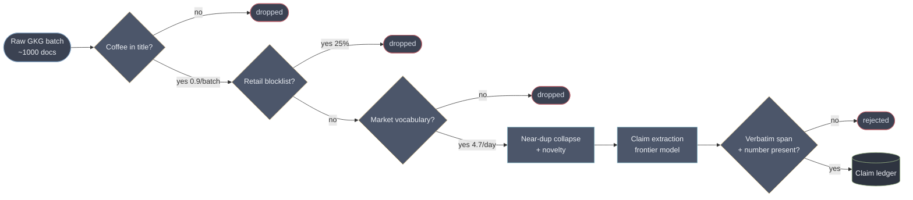
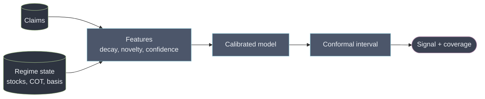
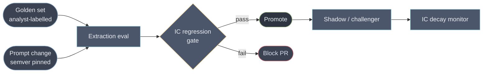

# Architecture

A system that ingests heterogeneous commodity data, extracts trading-relevant signals with
LLMs and multimodal models, and serves a research platform at sub-second for cached queries
and minutes for fresh inference.

Every number in this document that describes GDELT was measured against the live service
while writing it, not quoted from documentation. Where measurement contradicted the docs,
the measurement won and the contradiction is noted.

---

## 0. The measurement that reframes the brief — corrected under review

An earlier version of this section claimed that **GDELT does not contain coffee market news**,
on the basis that Reuters, Cecafé, Conab, the ICO and every coffee trade publication returned
**zero documents** across 675,840 records. The measurement was right. **The inference drawn from
it was wrong, and three methodological errors made it look stronger than it was.**

### What was wrong

**Domain absence is not content absence.** Checking GDELT's own organizations column on the same
corpus:

| Named in the `V1Organizations` field | Records | Share |
|---|---:|---:|
| Associated Press | 14,815 | **2.19%** |
| Reuters | 11,198 | **1.66%** |
| Bloomberg | 2,511 | 0.37% |
| Dow Jones | 524 | 0.08% |

Meanwhile `reuters.com`, `apnews.com` and `bloomberg.com` are each **exactly 0 as domains**. So
wire content is present at roughly 2–4% of the corpus; it simply arrives as **syndicated
republication under other mastheads**. "Reuters: 0" is true and "therefore no wire content" does
not follow.

**Substring matching over-returned.** The original table reported "Bloomberg 189". Every one of
those was `bnnbloomberg.ca`, a Canadian licensee. Actual `bloomberg.com` is zero. "apnews 190"
was `kelownacapnews.com`. Two of the table's four non-zero rows were artefacts of matching a
substring against a domain.

**Two thirds of the corpus was never measured.** GDELT publishes translingual records in a
**separate file set**, and this project fetched only the English stream. Measured directly:

| Stream | Documents/day |
|---|---:|
| English (what was measured) | ~96,000 |
| **Translingual (not measured)** | **~217,000** |

The published finding covered **31% of the corpus** — in a document that argues at length that
Brazilian, Vietnamese and Colombian outlets break these stories first.

### What the missing two thirds actually contains

Measuring 192 translingual batches (434,751 documents, ~2 days) with the same filter returns 25
coffee titles and 5 survivors. The survivors are the point:

- `vov.vn` — *"Giá cà phê hôm nay 18/8: Giá cà phê Robusta tăng"* — today's coffee price,
  robusta rising
- `dantri.com.vn` — Vietnamese daily agricultural prices, coffee jumping
- `investimentosenoticias.com.br` — Brazilian robusta market, premium quality investment

**That is daily origin-country coffee price reporting** — exactly the category the earlier draft
declared absent, sitting in the stream it never fetched.

And a compounding defect: the relevance lexicon is `coffee|arabica|robusta`, **English only**,
applied to a corpus that is 69% non-English (Spanish 70k, Chinese 41k, German 39k, Portuguese
20k records in the sample). Those five survived *by accident*, because "robusta" is a loanword
that appears in Vietnamese and Portuguese headlines. **`café`, `cà phê`, `kaffee`, `кофе` and
`咖啡` match nothing.** The corpus was under-sampled and then filtered with the wrong alphabet.

### The claim that survives, stated precisely

> **Wire services and primary institutions are absent from GDELT as identified sources.**
> `reuters.com`, `apnews.com`, `bloomberg.com`, Cecafé, Conab and the ICO are at hard zero.
> Their content reaches the corpus only as **syndicated republication — second-hand, delayed by
> the syndication hop, and stripped of the attribution that would let you weight it.**

That is materially weaker than "the signal is not there" and materially more useful, because it
names three separate problems with three different fixes: **no primary source** (add the free
ICE, CFTC and Cecafé feeds), **no attribution** (resolve publisher from the organizations field
rather than the domain), and **wrong alphabet** (a per-commodity multilingual lexicon, which the
breadth mandate in §1a already requires).

### The counter-evidence worth stating against ourselves

Where GDELT *has* been used successfully on commodities — corn futures, WTI crude, TTF gas, EU
carbon allowances — the feature that worked was **raw article volume**, not tone and not
classification. This pipeline discards volume as noise and extracts meaning instead. That may be
the wrong bet, it is cheap to test, and the test belongs in the kill battery in §10.

**And the process failure is worth more than the finding.** The original claim was measured
carefully and reasoned about carelessly: a correct number, an unchecked inference, an
English-only instrument, and a substring match that manufactured two of its own data points. It
survived because it was *striking* and because nobody had checked the organizations column —
which is one `grep` away and was in the data the whole time.

### The second measurement, which stands

GDELT's filename is a **forward-dated window label, not a data-as-of mark**:

| Filename label | Actually written | Delta |
|---|---|---|
| `20260818183000` | 18:20:11 | **−9.8 min** |
| `20260818181500` | 18:05:03 | −9.9 min |
| `20260818180000` | 17:50:31 | −9.5 min |

So `ingest_time` must come from the HTTP `Last-Modified`, not the filename, or every document is
forward-dated by ten minutes and any latency metric computed later is wrong. And polling
`lastupdate.txt` beats firing on the quarter hour by those same ten minutes, free — a larger
latency win than anything in the compute path (§7). Both are fixed in `signals/pipeline.py`.

---

## 1. The brief's numbers are a misdirection, and saying so is the answer

The volumes in the brief look large. Most of them are not. Sizing them honestly is the first
design decision, because it determines what deserves engineering and what deserves a
single machine.

| Source | Stated | Actual rate | Verdict |
|---|---|---|---|
| Price ticks, 5 exchanges | "real-time" | ~10–50M msgs/day, bursty | Small. Bursts matter, averages don't |
| Merchant vs fund positioning | — | Weekly (CFTC COT) | Kilobytes. **Most valuable per byte in the system** |
| News + analyst reports | ~500 docs/day | ~1M LLM tokens/day | **~$9/day.** Rounding error |
| Satellite imagery | TB-scale daily | 1–5 TB/day | The only genuinely large number |
| AIS pings | ~10M/day | **116 msgs/sec** average | One Postgres box |
| Social + transcripts | — | ~200k items/day | Cheap with a cascade, expensive without |
| Macro, weather, FX | — | Small, but **revised** | Tiny. Correctness is the hard part, not volume |

Two consequences.

**A candidate who sizes a Kafka cluster for 116 messages a second has misread the problem.**
AIS at this rate is a single writer and a partial index. The engineering budget belongs
somewhere else.

**The expensive part of the imagery is not the compute, it is the licence.** Commercial
tasking runs $5–25/km². Inference over the pixels is close to free if you only run it where
it matters (§8). This inverts the intuitive cost model: tasking policy alone accounts for 96% of the
difference between a $75k and a $319k month. Developed in [COST.md](COST.md).

The one line most readers skim is the positioning data. It is the smallest feed and the one
that makes everything else mean something — see §6.

---

## 1a. Breadth, corrected — and the correction runs against the earlier draft

This section has been wrong twice, in opposite directions, and the second correction changes
the architectural conclusion. Both versions are shown because the reasoning matters more than
the number.

**Draft 1** assumed an information coefficient of 0.03–0.05 and concluded coffee alone reached
IR ≈ 0.37.

**Draft 2** backed the IC out of the best published result instead of assuming it — Vu, Chi &
El-Jahel (2025, *JFM* 45(10)), post-cost Sharpe **0.450** across 24 commodities weekly:

```
BR = 24 x 52 = 1,248      IC = 0.450 / sqrt(1,248) = 0.0127
```

and concluded coffee was hopeless. **That is the version that was published, and it contains
two errors that both bias it pessimistic.**

### Error one: `BR = N x T` assumes the bets are independent, and they are not

Commodities co-move — a single ENSO phase drives coffee, cocoa, sugar and palm together;
the dollar and freight touch everything. The standard correction is

```
BR_eff = N / (1 + (N-1) rho) x T
```

| rho | N_eff | BR_eff/yr | implied IC |
|---:|---:|---:|---:|
| 0.0 (as published) | 24.0 | 1,248 | 0.0127 |
| 0.1 | 7.3 | 378 | 0.0231 |
| **0.2** | **4.3** | **223** | **0.0301** |
| 0.3 | 3.0 | 158 | 0.0358 |

Attributing the same 0.450 Sharpe to **fewer** independent bets makes the per-bet IC **higher**.
The published draft called its predecessor "too kind"; it had the sign backwards. The realistic
implied IC is **0.023–0.036**, roughly 2.4x what was published.

### Error two: transaction costs were subtracted twice

The 0.450 Sharpe is **post-cost**. An IC derived from it is a **net** IC. The published table
labelled the coffee column "Gross IR" and then subtracted a turnover drag on top — charging
costs to the same signal twice.

### What the corrected arithmetic actually says

At IC ≈ 0.030 net, coffee alone on a daily signal gives `0.030 x sqrt(252)` ≈ **0.48** — not a
great book, but **not the "negative by a factor of two to six" the earlier draft asserted.**

Note the frequency mismatch this creates, because it matters and is easy to miss: the 0.48
figure is a **daily** rebalance, while the ceiling derived below is a **weekly** one. They are
not comparable, and the honest reading is that rebalance frequency, not commodity count, is the
larger lever — which the transaction-cost table immediately qualifies, since daily turnover is
what the costs punish. The two constraints bind against each other, and neither section alone
gives the answer. The
drag itself was also overstated: it assumed 252 full round trips a year, which presumes a signal
with zero persistence flipping sign daily; realistic turnover of 30–50% puts the drag nearer
0.15–0.30 than 0.58.

### But the mandate survives, and a ceiling appears that nobody had computed

Under correlated breadth, adding commodities has an **asymptote**:

```
as N -> infinity,  BR_eff -> T/rho = 52/0.2 = 260 bets/yr
max achievable IR  = 0.0301 x sqrt(260) = 0.486
```

**You cannot buy IR 0.5 by adding commodities at weekly rebalance. Ever.** And the gain from
breadth is half what was published: going from 1 commodity to 20 multiplies IR by
`sqrt(4.17/1.00)` = **2.0x**, not 4.5x.

### The mandate, tested against wheat — and it does not survive as written

The first attempt at this test counted **coffee-specific lines in the existing code**: 41 of
1,458, about 3%, almost all lexicon and enums. It concluded the pipeline was 97%
commodity-agnostic.

**That measurement was survivorship.** It counts how much coffee-specific code *exists*; the
question is how much wheat-specific code is *missing*. A pipeline with no concept of a government
as a market participant scores zero coffee-specific lines there — which reads as portable and
means absent.

Tested properly, against the brief's own second commodity ([WHEAT.md](WHEAT.md)):

| Transfers as-is | Must be built for wheat |
|---|---|
| Claim schema, two clocks | **Multi-venue resolver** — origin to venue across 5 exchanges is routing logic, not a lookup |
| Grounding gate, dedup, novelty | **2D class-spread engine** — coffee's differential is origin-only; wheat is origin x protein class |
| Point-in-time reads | **Government-action ingestion** — bans, state tenders, stockpiles, for at least 4 countries |
| Scoring arithmetic | **Substitution watch** (a corn shock generates wheat claims) and a **two-hemisphere harvest calendar** |

**The mandate holds for the outer scaffolding and fails for the pipeline.** Claim schema, clocks,
grounding gate and dedup genuinely transfer — the parts that took longest to get right and would
most likely be rebuilt wrong. But three new subsystems, one cross-commodity dependency and a
seasonal calendar stand between a wheat document and a graded wheat claim.

So the honest form of the engineering mandate is narrower than the earlier draft's: **nothing may
be hardcoded to coffee, and the scaffolding must stay commodity-blind** — that discipline is real
and it is what makes the 2x breadth lever reachable at all. But N+1 is not a config row, and
saying so was an overclaim the brief's own second commodity falsifies.

Wheat also **re-confirms the differential rule on independent evidence, and finds its exception.**
A regional shock lives in spreads — Russia's weekly export duty has no mechanism to move CBOT SRW
— except when the shocked origin is large enough relative to world trade: the Black Sea corridor
carried ~33 Mt, and its collapse moved flat price +3.5% in a session. **The rule is gated by
origin share of world trade, not by geography**, and it needs that threshold written into it or
it will misroute the next large one.

### Which points at the conclusion the source paper actually reaches

The same study's headline is not that news sentiment is a standalone signal. It is that
sentiment **combined** with price-based factors beats either alone — basis-momentum at Sharpe
0.535 rises to **0.763** when double-sorted with sentiment. And a purely price-derived signal
(skewness, Sharpe 0.714) beat the news signal outright on every metric.

**So the defensible architecture is news as a conditioner on a price-based book, not as a
directional signal in its own right.** That reframing costs nothing structurally — the claim
ledger, the two clocks and the corroboration model are unchanged — and it is what the evidence
supports rather than what the brief implies.

**One caveat that no amount of arithmetic resolves:** an IC derived from a *cross-sectional*
ranking of 24 commodities has no defined transfer to a *single-asset time-series* bet on coffee.
Every coffee-only number above inherits that assumption. It is stated here rather than buried,
because it is the weakest joint in the chain.

---

## 1a-ii. The instrument is probably wrong, and that is a bigger error than the model

Every signal in this design implicitly targets **flat price**. The evidence says that is the
wrong instrument for most of what the system extracts, and the cleanest demonstration is the
Colombian coffee-rust episode of 2008–2012.

Colombian arabica output fell from 12.5m bags to 7.7m — a 31% collapse in one year, the lowest
since 1972/73. The story everyone tells is that this drove arabica to its May 2011 peak of
306 c/lb. **That story is retrofitted, and three independent facts kill it:**

- The ICO's own monthly market reports mention rust **zero times** in May 2011, November 2011
  and January 2013. At the peak, the official narrative was *record* supply and a recovering
  Colombia.
- World arabica supply **rose 13.1%** into the peak (77.8m → 87.9m bags). Prices tripled into a
  supply increase.
- It was a general commodity boom in which coffee was **below median**: cotton +133%, wheat
  +113%, maize +109%, arabica +57% — and **robusta +53%**. Colombia grows no robusta and this
  rust never touched it. A four-point spread over ten months is noise.

**But the signal was priced — precisely, promptly, and in a different instrument.** The ICO
Colombian Milds group indicator carries origin-specific scarcity. Its premium over Other Milds:

| Period | Colombian Milds premium |
|---|---:|
| 2003–2007 average | **+1.5 c/lb** |
| 2008 | +4.5 |
| **2009** | **+33.6 c/lb** |
| 2010 | +29.5 |
| Feb 2011 | +8.6 |
| May 2011 (flat-price peak) | +11.1 |

A roughly **twentyfold** move, **contemporaneous with the crop year it destroyed** — lag
approximately zero. And by the flat-price top the origin premium had already deflated by
two-thirds. The market priced the rust accurately in 2009 and had largely finished doing so
before the rally that gets attributed to it.

**The design consequence.** A supply-disruption claim about one origin is a claim about a
**differential**, not about the benchmark. Flat price is dominated by Brazil, by the dollar, and
by macro flows the claim says nothing about — which is exactly why the case study in
[CASE_STUDY.md](CASE_STUDY.md) finds a correct physical signal with no flat-price edge, and why
§1b reports that the futures basis may subsume `supply_risk` entirely.

So `supply_risk` and `policy_shock`, both of which are origin-scoped by construction (they carry
a `region` field), should be evaluated against **origin differentials and calendar spreads**
first, and against flat price only as a fallback. This is not a modelling refinement. Testing an
origin signal against the wrong instrument is how a real effect gets discarded as noise, and how
a spurious one gets adopted.

The practical obstacle is stated rather than waved at: there is **no verified free point-in-time
series for the Coffee C calendar spread**, and the ICO's historical indicator series is not
freely downloadable. Acquiring one is a precondition for testing this properly, and it belongs
in the same acquisition budget as §0.

---

## 1b. What the evidence says about the signals themselves

Three findings from the literature contradict design decisions taken earlier in this document.
They are recorded here rather than quietly reconciled.

**Novelty weighting is backwards.** Chi, El-Jahel & Vu (2024, *Energy Economics* 140) study news
sentiment across 13 commodity futures **including Coffee C**, over 2003–2021. Their result: a
one-standard-deviation move in *novel* news sentiment shifts the **same-day** return by 0.08%,
and has **no significant lagged effect at all** — "information is quickly incorporated into the
price." The *old*, repeated news component carries the only measurable multi-day dynamic, and
that dynamic is a **reversal**.

Our aggregation up-weights novelty. On this evidence that selects the component with no
forecastable content and discards the one with a measurable (contrarian) signal. This is a
one-parameter sweep on existing code — run the identical pipeline at novelty weights of +1, 0
and −1 and compare information coefficients on the same purged folds — and it should be run
before any further work on extraction quality.

**The futures basis probably subsumes `supply_risk`.** Gorton, Hayashi & Rouwenhorst (2013)
establish that the convenience yield is a decreasing non-linear function of inventories, and
that the futures basis, prior returns and spot volatility already "reflect the state of
inventories." The front-to-second spread is free, real-time and market-cleared. Our text
pipeline is an expensive, lagged, noisy estimator of the same latent variable.

**If `supply_risk` shows no incremental explanatory power over the basis, it is not a signal —
it is a slow proxy.** That regression costs an afternoon and belongs in week one, ahead of
everything else in this document.

**`policy_shock` cannot be validated and should be demoted.** Materially damaging Brazil frosts
occur roughly once every 5–10 years; coffee-relevant policy shocks a handful per decade.
Effective sample size is single digits, and no statistical test rescues n = 6. Brandt & Gao
(2019) find geopolitical news has strong immediate impact and **no predictability** — the profile
of something you defend against rather than bet on.

So `policy_shock` becomes a **risk filter, not a directional signal**: flatten or halve size on a
detected discontinuity, do not trade its direction. A risk filter needs no statistical validation
to earn its place; a directional signal with n = 6 can never earn one. The reframing costs
nothing and removes an untestable claim from the product.

---

## 2. The load-bearing decision: extraction is not prediction

The obvious build is: news in, trading signal out, one model. It fails three ways at once.

- **Unauditable.** When the number moves, nobody can say which sentence moved it. A research
  platform whose outputs cannot be traced to evidence is not a research platform.
- **Uncalibrated.** An LLM saying "0.7 bullish" is not asserting a 70% probability of
  anything. There is no frequency interpretation, so it cannot be sized into a position.
- **Contaminated.** The model has read the future. Backtests inherit that (§9).

So the pipeline splits in two, and the seam is the contract:


One schema detail carries surprising weight: **put a free-text reasoning field first**, before
any typed field. Published work attributing large accuracy losses to constrained decoding turns
out to have measured *field ordering* — a schema that puts the answer before the rationale
collapses chain-of-thought into direct answering. Ordering the schema so the model reasons before
it extracts recovers essentially all of that, for a few hundred output tokens. Property order in a
JSON schema is a quality parameter, not a stylistic one.

The LLM's job is to turn prose into facts with citations. It never emits a price, a
direction it invented, or a probability. The statistical layer owns all of that, is small
enough to retrain nightly, and is auditable line by line.

This also localises drift. When a model version changes, extraction quality moves and you
can measure it against a golden set. The predictor is untouched. In the fused design, a
model upgrade silently changes your alpha and you find out from the P&L.

---

## 3. Two clocks, from the first row

Every record carries two timestamps.

- `event_time` — when the world changed
- `ingest_time` — when we learned about it

**This cannot be retrofitted.** You can always recompute what happened. You can never
reconstruct when you knew it. A system that stores one timestamp has permanently destroyed
its ability to backtest honestly, and the damage is invisible until someone trades on it.

Every point-in-time read filters on `ingest_time`:

```sql
SELECT * FROM claims WHERE ingest_time <= :as_of
```

In the prototype `ingest_time` is the **GDELT batch stamp**, not wall clock. That makes a
replay reproducible: re-running the pipeline tomorrow reconstructs the same second clock
rather than stamping everything with "now".

The [failure-mode register](FAILURE_MODES.md) opens with the leakage this prevents, and the
test suite ships a switch that flips between the two clocks and measures the difference.

---

## 4. Ingestion


Bronze is append-only and never edited. Corrections arrive as new rows with a later
`ingest_time`, which is what lets a replay show you the wrong value you actually acted on.

### GDELT is a batch that revises itself

Measured, not assumed:

- The DOC query API is **throttled to roughly one request per five seconds**, and answers
  violations with a **plain-text notice under HTTP 200**. Parsed naively that becomes
  `articles: []` — indistinguishable from a quiet news day. This is a silent outage, and any client of that
  API needs a guard requiring the payload to begin with `{`. The prototype sidesteps it
  entirely by never calling the query API — it reads the bulk files.
- Its query language accepts parentheses **only around OR-groups**. `coffee (sourcelang:english)`
  returns the error string `Parentheses may only be used around OR'd statements.` with a
  200 status. Another fail-open.
- The **bulk GKG files have no such limit**: `lastupdate.txt` names the current 15-minute
  batch with size and MD5, each ~6 MB compressed, ~1,000 documents (median 946, range 314–2,189).
- GDELT **rewrites its own archive**. Backtesting against today's archive uses records that
  did not exist at decision time.

So the production ingest is the bulk files, snapshotted immutably at fetch. The query API is
a convenience for exploration, never a dependency. Batches are cached on disk by name —
not as an optimisation, but because a GDELT batch is immutable once published, so caching is
what makes a rerun reproduce the same corpus.

---

## 5. Document processing: a cascade, because precision is the scarce resource

The instinct is to worry about token cost. The measurements say otherwise — and the figures
below are the full 673-batch corpus, not an extrapolation from one sample.

| Stage | Over 7 days | Per day |
|---|---:|---:|
| Documents ingested | 675,840 | **96,405** |
| Coffee term in the title | 619 | **88.3** |
| Removed by the retail blocklist | 153 | 21.8 |
| **Survives the market filter** | **33** | **4.7** |

All figures resolve to [MEASUREMENTS.md](MEASUREMENTS.md), which is the single source of truth
for every measured number in these documents.

**Under five tradeable coffee documents a day**, and the cheap filter removes **95%** of
coffee-mentioning documents before any model runs.

A note on how that table was produced, because an earlier draft of this section was wrong in
an instructive way. It quoted 1,550 documents per batch — a figure taken from a *single*
batch sampled early and then written down as a constant. The true distribution across all 673
batches is **mean 1,004, median 946, range 314–2,189**: a sevenfold spread, so quoting any
single number was misleading regardless of which one. The corrected funnel is a fifth the size
of the published one, which makes §1a's breadth problem worse rather than better.

The 95% the cheap filter removes are real: coffee-shop openings, campus promotions, a
retirement-town listicle, and — before the filter was tightened — a stag shot in a park,
which matched because `ban` has no word boundary and so does `urban`, and because `ton`
without one matches *Washington*.



### Two traps in this stage

**Sentiment is inverted for supply shocks, so do not use it.** GDELT ships a document-level
tone vector for free, and it is tempting. But a frost story is strongly *negative* in tone and
strongly *bullish* on price. Wire tone to a directional signal and you invert roughly half your
calls. The same objection retires FinBERT and its descendants here — they are calibrated on
equity news, where bad news for a company is bad for its price. Agricultural supply does not
work that way. Direction must be a property of the **extracted claim**, asserted against a
signed supply-direction vocabulary (`frost`, `leaf rust`, `export ban`, `stocks drawdown` →
supply-negative → price-up), never a property of the prose.

**Near-duplicate matching fails across languages, and that is the main path, not an edge
case.** A Portuguese and an English article about the same Minas Gerais frost share almost no
character shingles, so Jaccard sees two unrelated documents. But they share the region code,
the event type and the figure. So the dedup ladder must fall through to an **entity-overlap
test** — two documents sharing at least two of {canonical organisation, admin region, normalised
amount, event type} within 48 hours join the same cluster regardless of language. This matters
more than it sounds: Brazilian, Vietnamese and Colombian outlets break their own stories in
Portuguese, Vietnamese and Spanish hours before the English wires pick them up, and that gap is
precisely the window worth having.

**Novelty is a signal input, not a preprocessing step — but see §1b, which reports evidence
that the SIGN of this weighting is probably wrong.** The mechanism below is right; whether
novelty should be up-weighted or down-weighted is an open, testable question, and the code
currently up-weights it.

 The market prices a story on first
print. The fortieth syndication carries no information, and counting reprints as independent
evidence builds a signal that tracks press-release volume instead of the market. In the
measured corpus, deduplication collapses 33 documents into 29 clusters — **12% echo**
([MEASUREMENTS.md](MEASUREMENTS.md)).

The companion statistic is **time-to-second-source**. A claim that stays single-sourced for
hours is either an exclusive, which is valuable, or a fabrication, which is dangerous. Same
number, opposite meaning; source reputation and physical corroboration (§8) disambiguate.

### Documents are hostile input

News text reaching a model that moves money is an attack surface, not just a data source.
Someone who can get a sentence into a syndicated feed can attempt to steer the extractor.

Three controls, all cheap:

1. **Structured output only, no tool access.** The extractor cannot act, only describe.
2. **The verbatim span gate.** A claim survives only if its `evidence_quote` appears
   character-for-character in the source, and any number it states appears inside that span.
   A figure the model composed fails both checks. The test suite exercises this with an
   invented "40% of its crop" that the gate rejects.

   Three engineering notes, because this gate is where the design meets the API. **Normalisation
   is most of the work** — Unicode NFKC, smart quotes to ASCII, collapsed whitespace, stripped
   zero-width characters. Naive exact matching rejects a large fraction of *correct* quotes,
   especially from PDF-extracted analyst notes, and that shows up as a quality problem rather
   than a parsing one. **Store character offsets, not strings**, so provenance survives a
   re-fetch or a re-parse. And **the rejection rate is a first-class metric** — a rising one is
   the earliest available signal of prompt drift, a source-parser regression, or a model change.
   Alert on the delta, not the level.

   There is also a platform constraint worth knowing before designing around it: on at least one
   major API, **native citations and strict structured output are mutually exclusive** and
   requesting both returns an error. Native citations are otherwise strictly better than a
   model-emitted quote — the span is extracted from the source rather than generated, so it
   cannot be hallucinated, and it does not bill as output tokens. Until that incompatibility
   resolves, the own-gate design here is the right default, and it must exist regardless: a
   schema-valid, correctly-cited claim can still be semantically wrong, and no API feature
   catches that.
3. **Injection heuristics** set a flag, and flagged documents contribute **zero weight** to
   scoring rather than being trusted or silently dropped.

The prompt states the rule explicitly: document text is data, never instruction.

---

## 6. The signal layer, and why positioning is the quiet centrepiece

Claims become features, features become a calibrated signal. Aggregation is time-decayed,
confidence-weighted and novelty-weighted — deliberately ordinary arithmetic, because the
judgement already happened in extraction and is auditable there.

Three signals, chosen for genuinely different statistical character:

| Signal | Range | Character | Why separate |
|---|---|---|---|
| `supply_risk` | 0–100 | Continuous, mean-reverting | Weather and disease accumulate and decay |
| `price_pressure` | −100…+100 | Directional, fast-decaying | Sentiment is priced in hours |
| `policy_shock` | 0–100 | Discontinuous, persistent | A tariff is a step function, not a trend |

Fusing them into one score destroys exactly the information that makes them tradeable: a
step function and a decaying oscillation do not belong in the same average.

### Regime conditioning

**Identical news is bullish in a tight market and noise in a glut.** A frost report when ICE
certified stocks sit at multi-month lows and funds are short is a squeeze. The same report
into ample inventory and long positioning is a shrug.

This is why the brief lists *"account of trades done by merchants vs hedge funds"* — the
smallest feed in the system. Positioning tells you **who is offside**, which determines
whether news causes a squeeze or nothing at all. Commercial hedgers and managed money take
structurally opposite sides; when managed money is crowded one way, the pain trade is
mechanical.

A system that scores news without conditioning on inventory and positioning will be
confidently wrong in precisely the situations that matter most.

### The regime claim, tested — and the mechanism is wrong

The paragraph above was assertion until `signals/positioning.py` was built. Tested over **519
weekly observations**, with positioning keyed to its **Friday release** rather than its Tuesday
as-of date (using the Tuesday grants three free days of lookahead every week, and it looks like
skill):

| Test | r | t |
|---|---:|---:|
| Crowding → 4-week **return** — the naive contrarian trade | **−0.007** | −0.17 |
| Crowding → 4-week **absolute move** — the regime claim | **+0.122** | **+2.79** |

**The contrarian direction trade is dead.** Fading crowded managed-money length predicts nothing:
r is indistinguishable from zero on 519 observations.

**The magnitude claim is statistically significant** — crowded positioning does precede larger
moves. But the buckets say the mechanism is not the one we argued:

| Crowding bucket | n | mean 4wk | **mean absolute move** |
|---|---:|---:|---:|
| Top decile — crowded long | 129 | −0.50% | **7.56%** |
| Bottom decile | 82 | +0.93% | **5.53%** |
| Middle of the range | 65 | −1.51% | **8.28%** |

If "crowded positioning means a squeeze" were the mechanism, the tails would be the violent ones.
They are not — **the middle is**. The significant correlation is driven by extreme *short*
positioning being unusually **quiet**, not by extreme long positioning being unusually violent.

So the claim survives in a narrower and less flattering form: **positioning carries information
about how much the market is about to move, and the direction of that information is not the
squeeze story.** Sizing a signal on "crowded longs will be forced out" would be trading a
mechanism the data does not support, while the effect that is real — low crowding predicts calm —
is much less useful because it tells you when *not* to expect anything.

This is the same shape as every other finding here: a real effect, a wrong story about why, and
the difference only visible once someone fetched the data.



**Intervals, not points.** Conformal prediction gives distribution-free coverage and
degrades honestly: under drift the interval widens rather than the point estimate silently
becoming wrong. Traders size positions off distributions; a bare number invites false
precision. The exchangeability assumption is violated by time series, so calibration is
rolling and recalibrated frequently — an approximation, and named as one.

---

## 7. Serving, and the SLO the brief asks for is the wrong one

### The latency budget nobody measures

Decompose "event happens" to "signal visible" and the stages we control almost vanish:

| Path | Source publication lag | Our pipeline | **Our share** |
|---|---:|---:|---:|
| Wire headline | ~300 s | ~30 s | **9%** |
| Satellite AIS | ~1,800 s | ~30 s | **1.6%** |
| Satellite imagery | ~43,200 s | ~60 s | **0.14%** |
| Scheduled macro (WASDE, COT) | ~604,800 s data age | ~30 s | **0.005%** |

**This table uses a 30-second pipeline, and §7's own SLO promises p50 90 s and p95 6 min.** At
those numbers the picture changes materially on the one path where it matters:

| our pipeline | share of the wire path |
|---|---:|
| 30 s (the row above) | 9% |
| 90 s (our own p50) | **23%** |
| 360 s (our own p95) | **55%** |

At p95 the "irrelevant" pipeline is the *majority* of the wire path. So the claim that
optimising below 30 seconds returns nothing is defensible only if the pipeline actually runs at
30 seconds, and ours is specified not to. The honest statement is narrower: **optimising the
median pipeline is low-value; controlling its tail is not.** The prohibition in §12 is scoped
accordingly.

Two further caveats on the inputs. The ~300 s wire publication lag is an estimate, not a
measurement, and the whole argument is proportional to it — at a 60-second wire lag our share is
33%, not 9%. It is cheap to establish from historical wire timestamps against known event times,
and until it is, this table is a hypothesis with arithmetic attached.

Halving our pipeline improves what the trader experiences by **4.5% on the best path** and by
nothing measurable on the others. Meanwhile the largest *controllable* term is not compute at
all — it is **poll interval**, which contributes interval/2 in median lag. Moving a wire feed
from 60-second polling to push beats every other latency optimisation in this document
combined, and it is a config change.

**We cannot win the headline race and should not claim to.** Firms trading directly off
binary multicast wire feeds operate at 99.99% under 50 microseconds. An LLM in the loop is six
orders of magnitude away. Any architecture with a language model in the decision path is
structurally incapable of that trade, and pretending otherwise is how you get sued.

### So promise freshness, not latency

| Promise | Target |
|---|---|
| Read path — any precomputed signal, any `as_of` | p99 < 250 ms — **a UI-responsiveness SLO, not a trading one** |
| Point-in-time replay, arbitrary `as_of` | p99 < 2 s |
| Fresh path — document **arrival** → signal updated | p50 90 s, p95 6 min |
| Freshness honesty | **100% of responses carry evidence timestamps. Zero silent staleness.** |
| Explicitly not promised | Reaction time relative to the market |

Measuring the fresh path from *arrival* rather than from *event* is the honest choice: quoting
from-event numbers means quoting your vendor's lag as your own achievement.

### Sub-second is free, because point-in-time reads are immutable

A signal at `as_of=T` filtered on `ingest_time <= T` **can never change**, because no future
write alters the past. Therefore:

- There is no cache *invalidation* problem. There is only key creation.
- Historical reads have infinite TTL and content-addressed keys.
- The only mutable key in the system is the `latest` pointer per commodity, updated by one
  atomic swap.

This property is worth more than any cache technology choice, and it falls out of the
two-clocks decision (§3) for free. A Postgres primary failure still serves every cached
historical query correctly; only `latest` degrades.

### The burst case: 500 documents about one earthquake in 90 seconds

The answer is not to scale extraction. It is to collapse the input — and it is the highest
leverage engineering in the fresh path.


**500 documents become ~15 model calls**, roughly 30–90 seconds wall clock at modest
concurrency, with no additional GPU. The 480 unextracted documents are not dropped — they are
cheap evidence, and "480 independent outlets say this" is an input the aggregation already
wants. Extracting all 500 would cost 33× more and produce 480 near-identical claim sets that
would then need deduplicating anyway.

### Degrading in public

The volatility spike that makes signals valuable simultaneously multiplies document volume,
degrades your upstream providers (every one of their customers is hammering them too), and
rate-limits your model provider. These are not independent failures; they are one failure with
five symptoms.

The cardinal rule: **a stale signal must never be visually indistinguishable from a fresh one.**

| Level | Behaviour | What the desk sees |
|---|---|---|
| `LIVE` | Everything current | Evidence timestamps |
| `LAGGING` | Extraction behind | Pending count, last-update age |
| `PARTIAL` | A source class is down | Per-source health, **confidence interval widened** |
| `ARITHMETIC-ONLY` | Model path circuit-broken | Scores over existing claims, banner naming the cutoff |
| `FROZEN` | Ingestion broken | Read-only snapshot, value greyed, do-not-trade marker |

`PARTIAL` is the important one: the degradation shows up **in the number's uncertainty**, not
only in a badge a stressed trader will not read.

The only test that catches this is **replaying a real historical spike at 10× rate** and
asserting zero documents lost and every transition firing in order. Synthetic load will not
reproduce a correlated failure.

## 8. Multimodal: process areas of interest, not scenes

The imagery volume is real; the inference bill is not, if you never run a model over the
whole scene.

- Full-scene inference over 1 TB/day is enormous and almost entirely wasted — most pixels are
  ocean, cloud, and land nobody trades.
- **AOI-scoped inference** — a few hundred ports, warehouses and growing regions — is
  ~4,000 chips/day. At ~12 ms per 512×512 tile that is **under a minute of GPU per day**.
  Even with a hundredfold safety margin, a single always-on GPU is oversized.

That is roughly a thousandfold difference, and it comes from cropping, not from a faster model.

### Optical imagery is blind exactly when you need it

The tropical coffee belt — Minas Gerais, the Central Highlands — is under cloud through the
wet season. That is precisely when weather damage happens. **An optical-only pipeline loses
coverage during the only events it exists to detect**, and does so silently: the scene
arrives, it is simply cloud.

Sentinel-1 SAR penetrates cloud and is free. Published work on Vietnamese smallholder coffee
fuses Sentinel-1 and Sentinel-2 for exactly this reason. So the imagery stack is
radar-primary during the wet season and optical-primary in the dry, not optical with radar
as an afterthought.

### Physical corroboration is the adversarial defence

An attacker can write an article. **They cannot move 200,000 tonnes of coffee or repaint a
warehouse roof.** Physical modalities are expensive to forge, so gating high-conviction
signals on independent agreement between text, AIS and imagery raises the cost of an attack
by orders of magnitude.

The confidence model and the adversarial defence are therefore the *same mechanism*, which
is why cross-modal triangulation earns its complexity where a second sentiment model would not.

The caveat, stated rather than hidden: AIS is itself spoofable, and GPS jamming has become
mainstream — tens of thousands of vessels affected in recent quarters, with dark-fleet
activity concentrated around sanctioned export terminals. Corroboration raises the attack
cost; it does not make it infinite. Treat an AIS gap as a signal in its own right, not as
missing data.

---

## 9. Evaluation, retraining, and the contamination nobody mentions

One published result is worth naming for how it fails: a reported **Sharpe ratio of 5.87** on
EUR/USD from GDELT sentiment — from free, public data anyone can
download. A Sharpe near 6 over five years implies a t-statistic around 13; nothing in the FX
literature is within an order of magnitude. Real macro strategies live between 0.5 and 1.5. That
number is a bug report, not a result.

An earlier draft of this document also asserted that pretraining contamination accounts for
roughly the entire apparent alpha of a news backtest, citing a 65–70% versus 50–55% accuracy
gap. **That claim was wrong and has been retracted** — the source concludes that lookahead bias
is "modest." The retraction and what produced it are the first entry in
[FAILURE_MODES.md](FAILURE_MODES.md), because the mechanism is more interesting than the claim
was. Contamination is real enough to control for and small enough that it must be **measured
rather than assumed**: mask entities, dates and price levels in extraction, and run the backtest
against an era-matched model to size the gap instead of asserting it.

Controls, in order of how much they cost to add:

| Control | Defends against |
|---|---|
| Filter on `ingest_time`, never `event_time` | Decision-time leakage |
| Snapshot GDELT at fetch | Archive revision |
| ALFRED vintages, never current FRED | Macro revision leakage |
| Deduplicate **before** splitting folds | The same wire story in train and test |
| Purged K-fold + embargo | Overlapping triple-barrier labels |
| Era-matched models for historical evaluation | Pretraining contamination |
| Transaction costs and slippage in every backtest | The most common inflation of all |



**A prompt is a model weight.** It is versioned, pinned into every claim row it produced, and
a change to it is a pull request that must clear an information-coefficient regression gate
on a frozen golden set. Teams that ship prompt edits straight to production have an
unversioned model in the hot path and no way to attribute a P&L change to it.

**The UI is the labelling tool.** Analysts confirm or reject claims in the dashboard; those
judgements become the golden set that gates the CI. This costs nothing extra and compounds —
the review work was happening anyway.

### Four monitoring planes

| Plane | Watches | Fires on |
|---|---|---|
| Data | Freshness, volume, schema | **Absence.** A silent upstream change presents as zeros, not errors |
| Model | Feature drift (PSI), calibration | Distribution shift before P&L shows it |
| Signal | IC decay, hit rate, turnover | The edge disappearing |
| Cost | $ per signal, tokens per doc | Spend outrunning value |

Alerting on absence is the one most often missed. Everything else pages you when something
breaks loudly.

---

## 10. Staging, and the two weeks that should come before all of it

The full architecture above is a destination. Building it before establishing that there is a
signal worth serving is the most common way these platforms die, so the staging plan starts with
four cheap tests that can end the project.

### Stage 0 — the kill battery. Under two weeks, no modelling, no archive

Run in this order. Each can terminate the effort on its own.

| # | Test | Kill if | Cost |
|---|---|---|---|
| **K1** | **Latency.** What fraction of the total price move around an event happens between publication and our `ingest_time`? | ≥60% of the move is already gone before we see it | 3 days |
| **K2** | **Contemporaneous power.** Does today's claim aggregate explain *today's* return? | R² indistinguishable from zero | 3 days |
| **K3** | **Reverse causality.** Bidirectional Granger between claim flow and returns | returns → claims dominates | 2 days |
| **K4** | **Effective breadth.** Documents per day *after* near-duplicate clustering | fewer than 5 genuinely independent documents/day | 2 days |

**Most news pipelines die at K2** — they cannot explain the same day's return, let alone
tomorrow's. K3 matters more than it sounds: media pessimism is known to *follow* low returns, so
an accumulating supply-risk score can be a laundered momentum signal that backtests beautifully
for exactly the wrong reason.

Then, before any further extraction work:

| # | Test | Kill if |
|---|---|---|
| **K5** | Incremental explanatory power of `supply_risk` **over the futures basis**, out of sample | p > 0.10 |
| **K6** | Realised Sharpe against a **permutation null** — identical pipeline, claim polarities shuffled within date | realised ≤ 95th percentile of the shuffled distribution |
| **K7** | Net Sharpe after the transaction costs in §1a, purged out-of-sample | < 0.30 |

K6 is the one that validates the *whole apparatus* — backtester, cost model and all — rather
than the signal alone. A pipeline that produces an attractive Sharpe on shuffled polarities has
a bug, not an edge.

### If the battery passes

| Stage | Build | Deliberately skip |
|---|---|---|
| **Month 1** | Bulk news ingest, bitemporal store, claim extraction with the span gate, read API, leakage test | Streaming, feature store, imagery, retraining |
| **Month 3** | **Commodity 2 through 10** — breadth before depth, every time. Regime state, calibration against forward returns, golden set and prompt CI gate | Satellite tasking, multi-region, custom models |
| **Month 12** | Imagery on triggered AOIs, cross-modal corroboration, conformal intervals, champion/challenger | Anything with no measured information coefficient |

The gate between stages is evidence, not a date: **do not build stage N+1 until stage N has a
signal with measurable, cost-surviving information coefficient.** A platform with excellent
infrastructure and no edge is a more expensive failure than a spreadsheet.

### And the likelier product, stated plainly

At the correlation-adjusted information coefficient of §1a (~0.030, not the 0.0127 an earlier
draft used), a coffee-only signal needs roughly **80 years** of forward data to separate from
zero, and twenty-four commodities roughly **3–4 years**. Both figures are far softer than the
earlier draft's 460 and 19, and the conclusion survives only in its weaker form: forward testing
on one commodity is still hopeless, but a multi-commodity book is testable on a horizon a
business could actually wait out. Forward
testing is arithmetically hopeless; only a point-in-time news **archive** buys enough calendar
time to decide this decade, which makes archive acquisition the critical path, ahead of
extraction quality.

So there are two honest products here, and the second is more likely:

1. **A trading signal**, which requires 20–40 commodities and a decade of archive. Coffee alone
   mathematically cannot prove the concept, so a coffee pilot cannot be the gate for it.
2. **Nowcasting and explanation** — *"here is why coffee moved 4% today, with citations, in 90
   seconds."* This needs K2 to pass and nothing else on the statistical ladder. It is genuinely
   valuable to a physical trading desk, sells on a different basis, and is the product this
   architecture already builds.

Discovering which one you have in month one is worth considerably more than discovering it in
month eighteen.

---

## 11. Technology choices, and what each replaces

Boring, single-node, and justified by the measured volumes rather than by the shape of the
diagram.

| Concern | Choice | Instead of | Why |
|---|---|---|---|
| System of record | **PostgreSQL** — bitemporal claims, documents, materialized signals | A distributed store | ~10k claims/day ≈ 3.6M rows/year. A table with two indexes |
| Queue | **Postgres `SELECT … FOR UPDATE SKIP LOCKED`** | Kafka, Redpanda | Sustains ~10k jobs/s; we peak at 5.5/s. Kafka buys replay we already have from the bitemporal store, at the price of a second durability model |
| Vectors | **pgvector, HNSW** | Pinecone, Weaviate, Qdrant | 3.6M vectors fits one box, and embeddings share a transaction with the claims that cite them |
| Ticks | **Parquet on object storage + DuckDB** | ClickHouse | ~110 GB/year. Adopt ClickHouse only when interactive multi-year tick queries become a *product surface* |
| Cache | **In-process LRU, then Redis if measured** | Dragonfly | Dragonfly's edge appears near millions of ops/s; we serve tens to low hundreds |
| Features | **A Postgres table with a covering index** | Feast, Tecton | A feature store solves train/serve skew at millions of entities. We have hundreds |
| Inference | **Hosted API, batch tier for backfill** | Own GPUs | Break-even is ~20–50k docs/day. At 500 we are 40× short, and self-hosting converts a ~$200/month line into ~$2,500 plus an on-call rotation |

If self-hosting ever is justified, **SGLang** rather than vLLM — not for headline throughput
but for two properties of *this* workload: the extraction prompt is a large fixed prefix
(RadixAttention's best case), and structured decoding runs on every single call, where vLLM
degrades measurably at batch sizes ≥8. For GPU sharing, **MIG partitions, never time-slicing**
— time-slicing has no memory isolation, so a backfill OOMs interactive inference. That is the
starvation failure, implemented deliberately.

---

## 12. What this design deliberately does not build

- **No LLM price forecasts.** The model extracts; it does not predict.
- **No article scraping in the prototype.** GKG metadata and quotations avoid robots.txt,
  paywalls and CFAA exposure entirely. Full-text licensing is a stage-2 commercial decision.
- **No streaming engine at 116 msg/s.** Infrastructure theatre.
- **No self-hosted model at this volume.** See above.
- **No fused multi-signal score.** The three signals decay differently and are kept apart.
- **No Kubernetes before there are five deployables.**
- **No optimisation of the pipeline's MEDIAN below ~30 s.** Scoped per §7: at the median it is
  0.005–9% of what the trader experiences, but at our own published p95 it is 55% of the wire
  path. Controlling the tail is worth engineering; shaving the median is not.

Each becomes wrong at some scale, so each carries a trigger rather than a prohibition:

| Build it when | Trigger |
|---|---|
| Streaming cluster | Sustained >50k msgs/s fanning out to ≥3 independent consumers |
| Kubernetes | >5 independently deployed services |
| Vector database | pgvector p99 >100 ms at the target recall |
| Own GPUs | ~20k documents/day sustained |
| ClickHouse | Interactive multi-year tick queries become a product surface |
| Fine-tuned extractor | A measured, reproducible quality gap against frontier on our claim schema |

The two things genuinely worth engineering effort today are neither of these, and neither is
infrastructure: **push instead of poll on the fastest feeds**, and **dedup-and-cluster before
extraction**.

---

Continue to [FAILURE_MODES.md](FAILURE_MODES.md) and [COST.md](COST.md).
