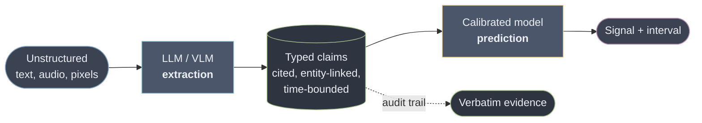
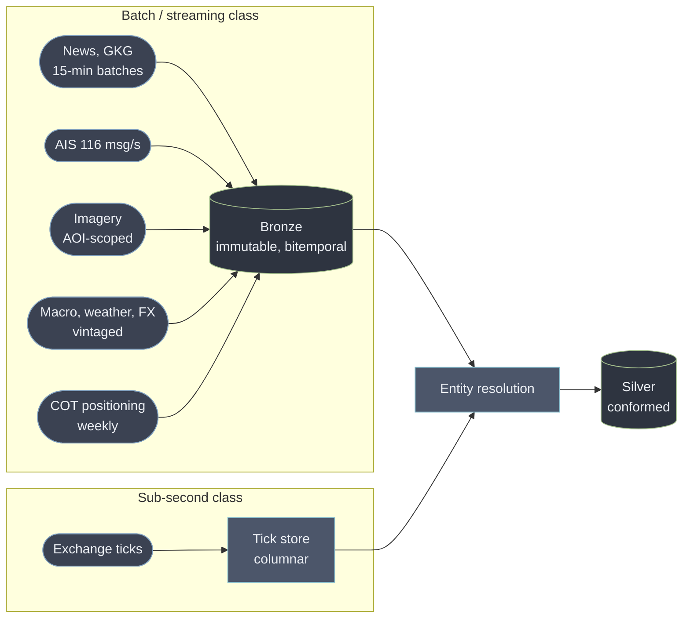
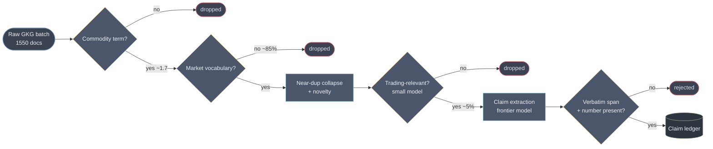
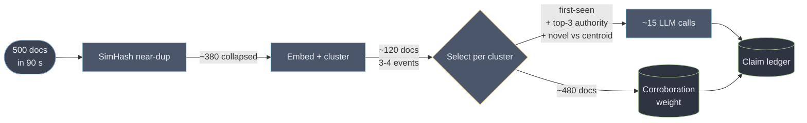

# Architecture

A system that ingests heterogeneous commodity data, extracts trading-relevant signals with
LLMs and multimodal models, and serves a research platform at sub-second for cached queries
and minutes for fresh inference.

Every number in this document that describes GDELT was measured against the live service
while writing it, not quoted from documentation. Where measurement contradicted the docs,
the measurement won and the contradiction is noted.

---

## 1. The brief's numbers are a misdirection, and saying so is the answer

The volumes in the brief look large. Most of them are not. Sizing them honestly is the first
design decision, because it determines what deserves engineering and what deserves a
single machine.

| Source | Stated | Actual rate | Verdict |
|---|---|---|---|
| Price ticks, 5 exchanges | "real-time" | ~10–50M msgs/day, bursty | Small. Bursts matter, averages don't |
| Merchant vs fund positioning | — | Weekly (CFTC COT) | Kilobytes. **Most valuable per byte in the system** |
| News + analyst reports | ~500 docs/day | ~1M LLM tokens/day | **~$9/day.** Rounding error |
| Satellite imagery | TB-scale daily | 1–5 TB/day | The only genuinely large number |
| AIS pings | ~10M/day | **116 msgs/sec** average | One Postgres box |
| Social + transcripts | — | ~200k items/day | Cheap with a cascade, expensive without |
| Macro, weather, FX | — | Small, but **revised** | Tiny. Correctness is the hard part, not volume |

Two consequences.

**A candidate who sizes a Kafka cluster for 116 messages a second has misread the problem.**
AIS at this rate is a single writer and a partial index. The engineering budget belongs
somewhere else.

**The expensive part of the imagery is not the compute, it is the licence.** Commercial
tasking runs $5–25/km². Inference over the pixels is close to free if you only run it where
it matters (§8). This inverts the intuitive cost model: tasking policy alone accounts for 96% of the
difference between a $75k and a $319k month. Developed in [COST.md](COST.md).

The one line most readers skim is the positioning data. It is the smallest feed and the one
that makes everything else mean something — see §6.

---

## 1a. Breadth is the viability condition, and it is an architectural mandate

Everything else in this document is downstream of one piece of arithmetic.

Seven days of real coffee coverage, measured from our own corpus, yields **8 distinct claim
themes** — roughly 1.1 a day, about **417 independent bets a year**. The fundamental law of
active management gives the information ratio as `IC x sqrt(breadth) x transfer coefficient`:

| Information coefficient | Transfer | Breadth | Gross IR |
|---|---|---:|---:|
| 0.02 | 0.6 | 417 | 0.25 |
| 0.03 | 0.6 | 417 | **0.37** |
| 0.05 | 0.6 | 417 | 0.61 |
| 0.08 | 1.0 | 417 | 0.98 |

Even at an implausibly good IC of 0.08 with frictionless implementation, **coffee alone tops
out near 1.0 gross, before transaction costs**. At a realistic 0.03 it is 0.37 — a marginal
sleeve, not a business.

Inverting it, to reach a defensible IR of 1.5 you need roughly **6 comparable commodities at
IC 0.05, or 17 at IC 0.03.**

**So commodity plurality is not a roadmap item. It is the condition under which the system is
worth building at all**, and it converts directly into an engineering requirement:

> The marginal cost of commodity N+1 must be near zero.

Which means nothing may be hardcoded to coffee. The relevance lexicon, the origin-region
taxonomy, the driver enumeration, the entity graph and the extraction prompt are all **data,
not code** — parameterised per commodity and versioned alongside it. Adding wheat should be a
configuration row and a lexicon, not a pull request against the pipeline.

This is cheap to honour on day one and expensive to retrofit, which puts it in the same
category as the two clocks in §3: a decision whose cost is asymmetric in time.

The prototype in this repository is deliberately coffee-only, because the brief asked for one
end-to-end slice. Where it hardcodes coffee, that is a shortcut with a known ceiling and it is
marked as such in the code.

---

## 2. The load-bearing decision: extraction is not prediction

The obvious build is: news in, trading signal out, one model. It fails three ways at once.

- **Unauditable.** When the number moves, nobody can say which sentence moved it. A research
  platform whose outputs cannot be traced to evidence is not a research platform.
- **Uncalibrated.** An LLM saying "0.7 bullish" is not asserting a 70% probability of
  anything. There is no frequency interpretation, so it cannot be sized into a position.
- **Contaminated.** The model has read the future. Backtests inherit that (§9).

So the pipeline splits in two, and the seam is the contract:



The LLM's job is to turn prose into facts with citations. It never emits a price, a
direction it invented, or a probability. The statistical layer owns all of that, is small
enough to retrain nightly, and is auditable line by line.

This also localises drift. When a model version changes, extraction quality moves and you
can measure it against a golden set. The predictor is untouched. In the fused design, a
model upgrade silently changes your alpha and you find out from the P&L.

---

## 3. Two clocks, from the first row

Every record carries two timestamps.

- `event_time` — when the world changed
- `ingest_time` — when we learned about it

**This cannot be retrofitted.** You can always recompute what happened. You can never
reconstruct when you knew it. A system that stores one timestamp has permanently destroyed
its ability to backtest honestly, and the damage is invisible until someone trades on it.

Every point-in-time read filters on `ingest_time`:

```sql
SELECT * FROM claims WHERE ingest_time <= :as_of
```

In the prototype `ingest_time` is the **GDELT batch stamp**, not wall clock. That makes a
replay reproducible: re-running the pipeline tomorrow reconstructs the same second clock
rather than stamping everything with "now".

The [failure-mode register](FAILURE_MODES.md) opens with the leakage this prevents, and the
test suite ships a switch that flips between the two clocks and measures the difference.

---

## 4. Ingestion



Bronze is append-only and never edited. Corrections arrive as new rows with a later
`ingest_time`, which is what lets a replay show you the wrong value you actually acted on.

### GDELT is a batch that revises itself

Measured, not assumed:

- The DOC query API is **throttled to roughly one request per five seconds**, and answers
  violations with a **plain-text notice under HTTP 200**. Parsed naively that becomes
  `articles: []` — indistinguishable from a quiet news day. This is a silent outage, and it
  is why the ingest guard requires a payload to begin with `{`.
- Its query language accepts parentheses **only around OR-groups**. `coffee (sourcelang:english)`
  returns the error string `Parentheses may only be used around OR'd statements.` with a
  200 status. Another fail-open.
- The **bulk GKG files have no such limit**: `lastupdate.txt` names the current 15-minute
  batch with size and MD5, each ~6 MB compressed, ~1,550 documents.
- GDELT **rewrites its own archive**. Backtesting against today's archive uses records that
  did not exist at decision time.

So the production ingest is the bulk files, snapshotted immutably at fetch. The query API is
a convenience for exploration, never a dependency. Batches are cached on disk by name —
not as an optimisation, but because a GDELT batch is immutable once published, so caching is
what makes a rerun reproduce the same corpus.

---

## 5. Document processing: a cascade, because precision is the scarce resource

The instinct is to worry about token cost. The measurements say otherwise. Per 15-minute
GKG batch:

```
1,550 documents
   ↓  commodity term present            ~1.7
   ↓  market vocabulary present         ~0.25
```

Extrapolated: **~160 coffee-mentioning documents per day, of which ~15–25 are tradeable.**

The 85% the cheap filter removes are real: coffee-shop openings, campus promotions, a
retirement-town listicle, and — before the filter was tightened — a stag shot in a park,
which matched because `ban` has no word boundary and so does `urban`, and because `ton`
without one matches *Washington*.



**Novelty is a signal input, not a preprocessing step.** The market prices a story on first
print. The fortieth syndication carries no information, and counting reprints as independent
evidence builds a signal that tracks press-release volume instead of the market. In the
measured corpus, deduplication collapsed 50 documents into 24 clusters — **half the corpus
was echo**.

The companion statistic is **time-to-second-source**. A claim that stays single-sourced for
hours is either an exclusive, which is valuable, or a fabrication, which is dangerous. Same
number, opposite meaning; source reputation and physical corroboration (§8) disambiguate.

### Documents are hostile input

News text reaching a model that moves money is an attack surface, not just a data source.
Someone who can get a sentence into a syndicated feed can attempt to steer the extractor.

Three controls, all cheap:

1. **Structured output only, no tool access.** The extractor cannot act, only describe.
2. **The verbatim span gate.** A claim survives only if its `evidence_quote` appears
   character-for-character in the source, and any number it states appears inside that span.
   A figure the model composed fails both checks. The test suite exercises this with an
   invented "40% of its crop" that the gate rejects.
3. **Injection heuristics** set a flag, and flagged documents contribute **zero weight** to
   scoring rather than being trusted or silently dropped.

The prompt states the rule explicitly: document text is data, never instruction.

---

## 6. The signal layer, and why positioning is the quiet centrepiece

Claims become features, features become a calibrated signal. Aggregation is time-decayed,
confidence-weighted and novelty-weighted — deliberately ordinary arithmetic, because the
judgement already happened in extraction and is auditable there.

Three signals, chosen for genuinely different statistical character:

| Signal | Range | Character | Why separate |
|---|---|---|---|
| `supply_risk` | 0–100 | Continuous, mean-reverting | Weather and disease accumulate and decay |
| `price_pressure` | −100…+100 | Directional, fast-decaying | Sentiment is priced in hours |
| `policy_shock` | 0–100 | Discontinuous, persistent | A tariff is a step function, not a trend |

Fusing them into one score destroys exactly the information that makes them tradeable: a
step function and a decaying oscillation do not belong in the same average.

### Regime conditioning

**Identical news is bullish in a tight market and noise in a glut.** A frost report when ICE
certified stocks sit at multi-month lows and funds are short is a squeeze. The same report
into ample inventory and long positioning is a shrug.

This is why the brief lists *"account of trades done by merchants vs hedge funds"* — the
smallest feed in the system. Positioning tells you **who is offside**, which determines
whether news causes a squeeze or nothing at all. Commercial hedgers and managed money take
structurally opposite sides; when managed money is crowded one way, the pain trade is
mechanical.

A system that scores news without conditioning on inventory and positioning will be
confidently wrong in precisely the situations that matter most.


**Intervals, not points.** Conformal prediction gives distribution-free coverage and
degrades honestly: under drift the interval widens rather than the point estimate silently
becoming wrong. Traders size positions off distributions; a bare number invites false
precision. The exchangeability assumption is violated by time series, so calibration is
rolling and recalibrated frequently — an approximation, and named as one.

---

## 7. Serving, and the SLO the brief asks for is the wrong one

### The latency budget nobody measures

Decompose "event happens" to "signal visible" and the stages we control almost vanish:

| Path | Source publication lag | Our pipeline | **Our share** |
|---|---:|---:|---:|
| Wire headline | ~300 s | ~30 s | **9%** |
| Satellite AIS | ~1,800 s | ~30 s | **1.6%** |
| Satellite imagery | ~43,200 s | ~60 s | **0.14%** |
| Scheduled macro (WASDE, COT) | ~604,800 s data age | ~30 s | **0.005%** |

Halving our pipeline improves what the trader experiences by **4.5% on the best path** and by
nothing measurable on the others. Meanwhile the largest *controllable* term is not compute at
all — it is **poll interval**, which contributes interval/2 in median lag. Moving a wire feed
from 60-second polling to push beats every other latency optimisation in this document
combined, and it is a config change.

**We cannot win the headline race and should not claim to.** Firms trading directly off
binary multicast wire feeds operate at 99.99% under 50 microseconds. An LLM in the loop is six
orders of magnitude away. Any architecture with a language model in the decision path is
structurally incapable of that trade, and pretending otherwise is how you get sued.

### So promise freshness, not latency

| Promise | Target |
|---|---|
| Read path — any precomputed signal, any `as_of` | p99 < 250 ms — **a UI-responsiveness SLO, not a trading one** |
| Point-in-time replay, arbitrary `as_of` | p99 < 2 s |
| Fresh path — document **arrival** → signal updated | p50 90 s, p95 6 min |
| Freshness honesty | **100% of responses carry evidence timestamps. Zero silent staleness.** |
| Explicitly not promised | Reaction time relative to the market |

Measuring the fresh path from *arrival* rather than from *event* is the honest choice: quoting
from-event numbers means quoting your vendor's lag as your own achievement.

### Sub-second is free, because point-in-time reads are immutable

A signal at `as_of=T` filtered on `ingest_time <= T` **can never change**, because no future
write alters the past. Therefore:

- There is no cache *invalidation* problem. There is only key creation.
- Historical reads have infinite TTL and content-addressed keys.
- The only mutable key in the system is the `latest` pointer per commodity, updated by one
  atomic swap.

This property is worth more than any cache technology choice, and it falls out of the
two-clocks decision (§3) for free. A Postgres primary failure still serves every cached
historical query correctly; only `latest` degrades.

### The burst case: 500 documents about one earthquake in 90 seconds

The answer is not to scale extraction. It is to collapse the input — and it is the highest
leverage engineering in the fresh path.



**500 documents become ~15 model calls**, roughly 30–90 seconds wall clock at modest
concurrency, with no additional GPU. The 480 unextracted documents are not dropped — they are
cheap evidence, and "480 independent outlets say this" is an input the aggregation already
wants. Extracting all 500 would cost 33× more and produce 480 near-identical claim sets that
would then need deduplicating anyway.

### Degrading in public

The volatility spike that makes signals valuable simultaneously multiplies document volume,
degrades your upstream providers (every one of their customers is hammering them too), and
rate-limits your model provider. These are not independent failures; they are one failure with
five symptoms.

The cardinal rule: **a stale signal must never be visually indistinguishable from a fresh one.**

| Level | Behaviour | What the desk sees |
|---|---|---|
| `LIVE` | Everything current | Evidence timestamps |
| `LAGGING` | Extraction behind | Pending count, last-update age |
| `PARTIAL` | A source class is down | Per-source health, **confidence interval widened** |
| `ARITHMETIC-ONLY` | Model path circuit-broken | Scores over existing claims, banner naming the cutoff |
| `FROZEN` | Ingestion broken | Read-only snapshot, value greyed, do-not-trade marker |

`PARTIAL` is the important one: the degradation shows up **in the number's uncertainty**, not
only in a badge a stressed trader will not read.

The only test that catches this is **replaying a real historical spike at 10× rate** and
asserting zero documents lost and every transition firing in order. Synthetic load will not
reproduce a correlated failure.

## 8. Multimodal: process areas of interest, not scenes

The imagery volume is real; the inference bill is not, if you never run a model over the
whole scene.

- Full-scene inference over 1 TB/day is enormous and almost entirely wasted — most pixels are
  ocean, cloud, and land nobody trades.
- **AOI-scoped inference** — a few hundred ports, warehouses and growing regions — is
  ~4,000 chips/day. At ~12 ms per 512×512 tile that is **under a minute of GPU per day**.
  Even with a hundredfold safety margin, a single always-on GPU is oversized.

That is roughly a thousandfold difference, and it comes from cropping, not from a faster model.

### Optical imagery is blind exactly when you need it

The tropical coffee belt — Minas Gerais, the Central Highlands — is under cloud through the
wet season. That is precisely when weather damage happens. **An optical-only pipeline loses
coverage during the only events it exists to detect**, and does so silently: the scene
arrives, it is simply cloud.

Sentinel-1 SAR penetrates cloud and is free. Published work on Vietnamese smallholder coffee
fuses Sentinel-1 and Sentinel-2 for exactly this reason. So the imagery stack is
radar-primary during the wet season and optical-primary in the dry, not optical with radar
as an afterthought.

### Physical corroboration is the adversarial defence

An attacker can write an article. **They cannot move 200,000 tonnes of coffee or repaint a
warehouse roof.** Physical modalities are expensive to forge, so gating high-conviction
signals on independent agreement between text, AIS and imagery raises the cost of an attack
by orders of magnitude.

The confidence model and the adversarial defence are therefore the *same mechanism*, which
is why cross-modal triangulation earns its complexity where a second sentiment model would not.

The caveat, stated rather than hidden: AIS is itself spoofable, and GPS jamming has become
mainstream — tens of thousands of vessels affected in recent quarters, with dark-fleet
activity concentrated around sanctioned export terminals. Corroboration raises the attack
cost; it does not make it infinite. Treat an AIS gap as a signal in its own right, not as
missing data.

---

## 9. Evaluation, retraining, and the contamination nobody mentions

**A current LLM already knows how the 2024 Brazil drought resolved.** Research on
chronologically consistent models measures standard LLMs at 65–70% accuracy predicting price
moves from historical text, against 50–55% for era-matched models. That 10–15 point gap is
not skill. It is memory of the future, and it is roughly the entire apparent alpha of a
naive news backtest.

Two published results make the point concrete. One reports 50.63% returns over 28 months from
news sentiment and **never mentions transaction costs or slippage**. Another reports a
**Sharpe ratio of 5.87** on EUR/USD from GDELT sentiment — from free, public data that
anyone can download. Real macro strategies live between 0.5 and 1.5. A Sharpe near 6 is a
bug report, not a result.

Controls, in order of how much they cost to add:

| Control | Defends against |
|---|---|
| Filter on `ingest_time`, never `event_time` | Decision-time leakage |
| Snapshot GDELT at fetch | Archive revision |
| ALFRED vintages, never current FRED | Macro revision leakage |
| Deduplicate **before** splitting folds | The same wire story in train and test |
| Purged K-fold + embargo | Overlapping triple-barrier labels |
| Era-matched models for historical evaluation | Pretraining contamination |
| Transaction costs and slippage in every backtest | The most common inflation of all |


**A prompt is a model weight.** It is versioned, pinned into every claim row it produced, and
a change to it is a pull request that must clear an information-coefficient regression gate
on a frozen golden set. Teams that ship prompt edits straight to production have an
unversioned model in the hot path and no way to attribute a P&L change to it.

**The UI is the labelling tool.** Analysts confirm or reject claims in the dashboard; those
judgements become the golden set that gates the CI. This costs nothing extra and compounds —
the review work was happening anyway.

### Four monitoring planes

| Plane | Watches | Fires on |
|---|---|---|
| Data | Freshness, volume, schema | **Absence.** A silent upstream change presents as zeros, not errors |
| Model | Feature drift (PSI), calibration | Distribution shift before P&L shows it |
| Signal | IC decay, hit rate, turnover | The edge disappearing |
| Cost | $ per signal, tokens per doc | Spend outrunning value |

Alerting on absence is the one most often missed. Everything else pages you when something
breaks loudly.

---

## 10. Staging: what to build first

This matters more than the diagram. The full architecture above is a destination, and
building it before there is a signal worth serving is the most common way these platforms die.

| Stage | Build | Deliberately skip |
|---|---|---|
| **Month 1** | Bulk news ingest, bitemporal store, claim extraction with span gate, one commodity, a read API, the leakage test | Streaming, feature store, imagery, retraining |
| **Month 3** | Positioning + inventory regime state, calibration against forward returns, golden set + prompt CI gate, AIS for one trade lane | Satellite tasking, multi-region, custom models |
| **Month 12** | Imagery on triggered AOIs, cross-modal corroboration, conformal intervals, champion/challenger, cost governor | Anything with no measured IC |

The gate between stages is not a date, it is evidence: **do not build stage N+1 until stage N
has a signal with measurable, cost-surviving information coefficient.** A platform with
excellent infrastructure and no edge is a more expensive failure than a spreadsheet.

## 11. Technology choices, and what each replaces

Boring, single-node, and justified by the measured volumes rather than by the shape of the
diagram.

| Concern | Choice | Instead of | Why |
|---|---|---|---|
| System of record | **PostgreSQL** — bitemporal claims, documents, materialized signals | A distributed store | ~10k claims/day ≈ 3.6M rows/year. A table with two indexes |
| Queue | **Postgres `SELECT … FOR UPDATE SKIP LOCKED`** | Kafka, Redpanda | Sustains ~10k jobs/s; we peak at 5.5/s. Kafka buys replay we already have from the bitemporal store, at the price of a second durability model |
| Vectors | **pgvector, HNSW** | Pinecone, Weaviate, Qdrant | 3.6M vectors fits one box, and embeddings share a transaction with the claims that cite them |
| Ticks | **Parquet on object storage + DuckDB** | ClickHouse | ~110 GB/year. Adopt ClickHouse only when interactive multi-year tick queries become a *product surface* |
| Cache | **In-process LRU, then Redis if measured** | Dragonfly | Dragonfly's edge appears near millions of ops/s; we serve tens to low hundreds |
| Features | **A Postgres table with a covering index** | Feast, Tecton | A feature store solves train/serve skew at millions of entities. We have hundreds |
| Inference | **Hosted API, batch tier for backfill** | Own GPUs | Break-even is ~20–50k docs/day. At 500 we are 40× short, and self-hosting converts a ~$200/month line into ~$2,500 plus an on-call rotation |

If self-hosting ever is justified, **SGLang** rather than vLLM — not for headline throughput
but for two properties of *this* workload: the extraction prompt is a large fixed prefix
(RadixAttention's best case), and structured decoding runs on every single call, where vLLM
degrades measurably at batch sizes ≥8. For GPU sharing, **MIG partitions, never time-slicing**
— time-slicing has no memory isolation, so a backfill OOMs interactive inference. That is the
starvation failure, implemented deliberately.

---

## 12. What this design deliberately does not build

- **No LLM price forecasts.** The model extracts; it does not predict.
- **No article scraping in the prototype.** GKG metadata and quotations avoid robots.txt,
  paywalls and CFAA exposure entirely. Full-text licensing is a stage-2 commercial decision.
- **No streaming engine at 116 msg/s.** Infrastructure theatre.
- **No self-hosted model at this volume.** See above.
- **No fused multi-signal score.** The three signals decay differently and are kept apart.
- **No Kubernetes before there are five deployables.**
- **No optimisation of the pipeline below ~30 s.** It is 0.005–9% of what the trader
  experiences; the return is zero.

Each becomes wrong at some scale, so each carries a trigger rather than a prohibition:

| Build it when | Trigger |
|---|---|
| Streaming cluster | Sustained >50k msgs/s fanning out to ≥3 independent consumers |
| Kubernetes | >5 independently deployed services |
| Vector database | pgvector p99 >100 ms at the target recall |
| Own GPUs | ~20k documents/day sustained |
| ClickHouse | Interactive multi-year tick queries become a product surface |
| Fine-tuned extractor | A measured, reproducible quality gap against frontier on our claim schema |

The two things genuinely worth engineering effort today are neither of these, and neither is
infrastructure: **push instead of poll on the fastest feeds**, and **dedup-and-cluster before
extraction**.

---

Continue to [FAILURE_MODES.md](FAILURE_MODES.md) and [COST.md](COST.md).
