# Architecture

A system that ingests heterogeneous commodity data, extracts trading-relevant signals with LLMs
and multimodal models, and serves them at sub-second for cached queries and minutes for fresh
inference.

Every number here is measured or cited. Where a measurement contradicted an earlier assumption,
the current number is stated — see [EVIDENCE.md](EVIDENCE.md) for what was tested and what died.

---

## 0. The system, end to end

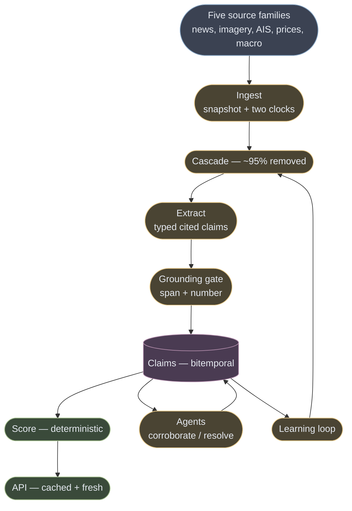

**Three moves.** Before the gate: *reducing* — 96,405 documents/day to 4.7 claims. At the gate:
*verifying* — nothing enters unless its evidence can be pointed at. After: *deterministic* —
arithmetic, not a model, makes the signal. The two feedback edges are the only cycles.

---

## 1. The brief's volumes are a misdirection, and saying so is the answer

| Stated | Actually |
|---|---|
| 10M AIS pings/day | **116 messages/second** — one Postgres box |
| ~500 documents/day | ~1M tokens, **single digits of dollars** |
| TB-scale daily imagery | genuinely large — but the cost is the **licence**, not the GPU |

Only imagery is big, and its cost is a *licensing and tasking-policy* problem rather than a
compute one ([COST.md](COST.md) §2: tasking policy alone is 96% of the gap between a careless
and a staged build). **A candidate who sizes Flink for the AIS feed has misread the brief.**

The genuinely load-bearing feed is the cheapest: **merchant-vs-fund positioning** tells you who is
offside, which decides whether news causes a squeeze or a shrug.

## 2. Breadth has a ceiling, and it is lower than it looks

Under the fundamental law with correlation-adjusted breadth:

```
BR_eff = N / (1 + (N-1)ρ) × T
as N → ∞,  BR_eff → T/ρ = 52/0.2 = 260 bets/yr
max achievable IR = 0.0301 × √260 = 0.486
```

**You cannot buy IR 0.5 by adding commodities at weekly rebalance. Ever.** Going from 1 commodity
to 20 multiplies IR by ~2.0x, not 4.5x.

The mandate — **nothing hardcoded to one commodity** — is real but narrow. Tested against wheat:
claim schema, two clocks, gate and dedup transfer; multi-venue resolver, class-spread engine and
government-action ingestion do not. **N+1 is cheap for scaffolding, not the pipeline**
(EVIDENCE §3).

---

## 3. The load-bearing decision: extraction is not prediction

**The LLM turns prose into typed, cited claims. Deterministic arithmetic turns claims into
signals. The model never emits a price, an invented direction, or a probability.**

The naive "news in, signal out" build is simultaneously unauditable (nobody can say why the
number moved), uncalibrated (an LLM's "0.7 bullish" is not a probability of anything), and it
pipes pretraining contamination straight into the predictor. Splitting fixes all three and makes
retraining cheap, because the expensive half stops changing.

## 4. Two clocks, from the first row

Every record carries `event_time` (when the world changed) and `ingest_time` (when we learned).
Every query names which it means; point-in-time reads filter on `ingest_time`.


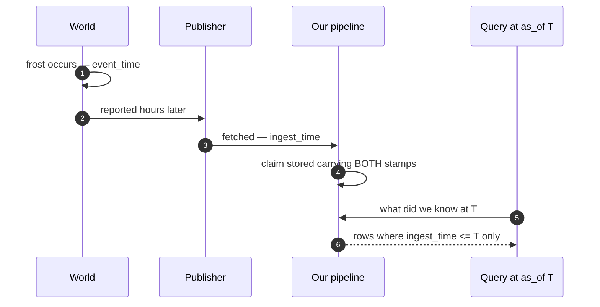

**This cannot be retrofitted.** You can recover when something happened; you can never recover
when you learned it. One column now, or an honest backtest never.

---

## 5. Heterogeneous data: fuse at the claim, never at the tensor

The reflex is a shared latent space. **Wrong level, for four reasons:** no shared time base (a
pass is 5–6 days, a tick 100ms — and the relative timing *is* the signal); forgeability differs by
orders of magnitude; a joint embedding is **unauditable**; three incompatible revision policies.

The level at which they are commensurable is the **claim**. Every modality is a sensor emitting a
typed measurement about a canonical entity, with a pointer to its own evidence:

| Modality | Evidence pointer |
|---|---|
| Text | **character span** in the immutable snapshot |
| Imagery | **AOI polygon + capture timestamp + pixel stats** |
| AIS | vessel id + position-track window |
| Price / stocks | series window + threshold used |
| Macro | release id + **vintage id** |


**The entity graph is what makes this one system** rather than three pipelines in a trenchcoat.
"Sul de Minas" in Portuguese prose, an AOI polygon, and a port call at Santos are the same subject
only because a canonical temporal entity resolves all three.

**Absence differs per modality, and conflating the two kinds breaks multimodal systems
silently.** Cloud is not "no damage"; a dark vessel is not "not sailing"; a failed fetch is not a
flat line. Every claim carries an **observation status** — `observed`, `observed_absent`,
`not_observed`, `degraded` — and unmeasured **widens the interval, never narrows it**. Hence SAR
over optical: radar sees through the cloud that blinds optical exactly during the wet season.

**Mixed frequency uses as-of joins, never resampling.** Weekly positioning stays weekly, daily
imagery stays daily; the model sees the lags explicitly rather than averaged away.

**Confidence is per-modality.** Three agreeing articles are one cheap fact repeated; an article
plus a draught change plus an AOI delta costs real money to fake. So **high conviction requires a
physical modality** — one rule serving as both the adversarial defence and the confidence model.

---

## 6. Ingestion and the cascade

One bus, per-source connectors, immutable bronze, bitemporal from row one. **GDELT is snapshotted
at ingest because it revises its own archive** — a backtest against its current archive reads
documents that did not exist at their claimed timestamps.

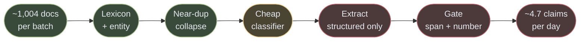

The measured funnel: 96,405 documents/day → 88.3 with a coffee term in the title → **4.7
tradeable**. The cheap filter removes **95% of coffee-mentioning documents**; end to end the
funnel is ~99.5%. Precision, not recall, is the scarce resource.

**The extractor is structured-output-only with no tool access.** Documents are hostile input, and
a model that can call tools on attacker-controlled text is an attack surface with a market
position attached.

### The grounding gate


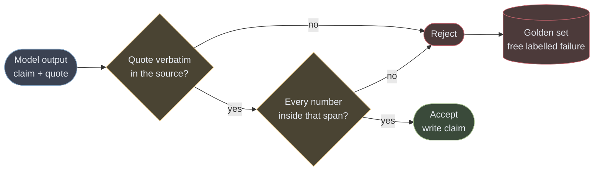

A numeric claim is rejected unless its figure appears **literally in the cited span**, NFKC-
normalised. This is the system's referee and it is deterministic.

Two rules that make it real rather than decorative:

- **Verify against the original, never the chunk.** Resolve against the chunk and a fabrication
  straddling a boundary verifies clean — the gate confirms the model's own input. Chunks carry
  `char_offset` back into the snapshot.
- **A check that cannot fail is worse than none**, because it reports as passing. This codebase
  shipped `nums_ok = _numbers(...) or True` — a gate claimed in three places that never existed.

### Chunking

**Most documents are not chunked.** A number in paragraph six is meaningless without the subject
in paragraph one, and wire stories fit one context. Chunking is for analyst PDFs and transcripts
only: split on **structural boundaries**, **never separate a number from its unit or subject**,
carry a document header into every chunk, store `char_offset`.

**No summarisation before indexing.** The gate verifies verbatim spans; a summary leaves nothing
to check. Every shipped precedent agrees — contextual retrieval *prepends* a blurb and never
replaces the chunk, cutting top-20 retrieval failure from 5.7% to 3.7%, and to 2.9% with
contextual BM25.

---

## 7. Retrieval: three of the four jobs are not search

The extractor gets **no retrieval** — the document is the input, and retrieved passages invite
citing text the source never contained. Retrieval serves memory, not context:


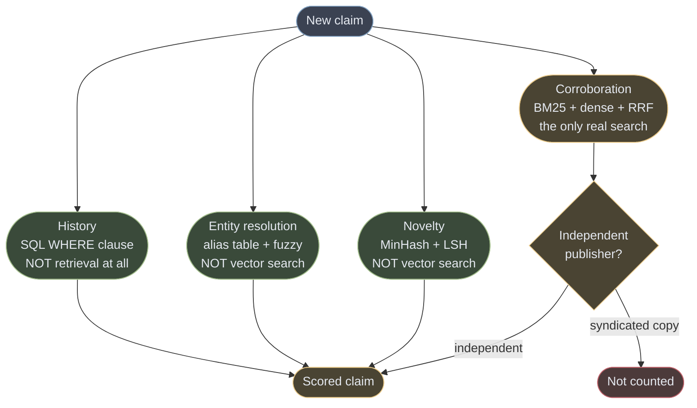

| Job | What it actually is |
|---|---|
| **Novelty** | **near-duplicate detection** — MinHash/SimHash + LSH. Cosine similarity conflates "same fact restated" with "related but distinct", the boundary that must stay sharp |
| **Entity resolution** | **record linkage** — alias table + fuzzy match resolves most mentions in microseconds; embeddings are fallback candidate generation, never auto-accept, and every resolution writes back |
| **History** | **a `WHERE` clause** on `(entity_id, time_range)` |
| **Corroboration** | the only genuine hybrid search |

**Hybrid is insurance against disjoint failure modes**, not a silver bullet. BM25 cannot connect
"Sul de Minas" to "South of Minas"; dense collapses on rare tokens — contract codes, exact figures.
Fusion itself buys ~1–1.7%. RRF (k=60) until accept/reject decisions supply labels, then a tuned
convex combination.

**A reranker would actively harm two jobs** — for novelty it ranks the duplicate highest, exactly
backwards; for corroboration it has no notion of publisher independence and ranks two syndicated
copies as mutually relevant. It earns its place only on disambiguating 5–20 entity-resolution
candidates.

**Corroboration is data engineering, not a better model.** Syndication is systematic and
text-similarity returns those copies *first*. The publisher/syndication graph is the whole
ballgame; measured dedup ratio 0.121 means **12% is echo**.

---

## 8. Storage and indexing


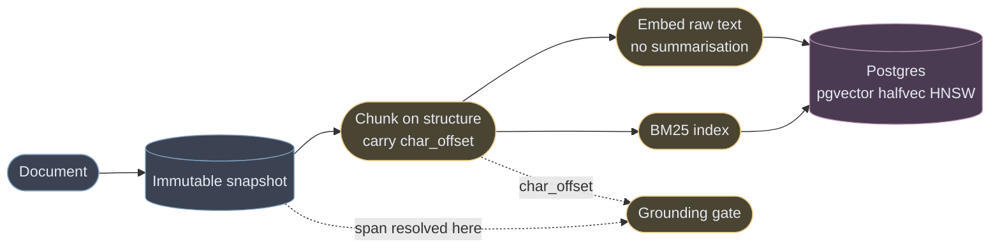

**The dotted edges carry the load.** The gate resolves a span against the *snapshot*, never the
chunk — otherwise a fabrication straddling a boundary verifies clean.

**One Postgres holds everything.** At this volume a dedicated vector database solves a problem we
do not have.

**Bitemporality via range types, not an extension** (none is maintained, and this is the most
correctness-critical table here):

```sql
EXCLUDE USING gist (
  claim_key       WITH =,
  effective_range WITH &&,   -- event_time
  asserted_range  WITH &&    -- ingest_time
)
```

Composite B-tree `(claim_key, ingest_time DESC)` serves the `as_of` filter and
latest-version-per-claim. Append-only; materialised "current" view and vacuum monitoring on day one.

| Finding | Number | Consequence |
|---|---|---|
| **pgvector's cliff is RAM, not vector count** | 32GB box, 1536 dims: ~2,100 QPS to 2M, **−45% at 2.5M**, **−95% by 3M (102 QPS)** — with buffer hit ratio still >98% | `halfvec`, `shared_buffers` above index size, truncate to 512 dims (retains 94–96% NDCG@10). Ceiling: **~10M provisioned, ~3M not** |
| **Filtered search collapses** | one broad filter → **90.8%** recall; AND of two → **39.7%** | Pre-filtering fragments the HNSW graph, post-filtering silently returns zero. **pgvector 0.8+ iterative scans are load-bearing** |
| **Multilingual excludes the finance embedders** | sources are PT/VI/ES; no finance-tuned embedder demonstrates coverage | Keep the index multilingual; take finance lift from a downstream reranker |

**Metadata that earns its place:** `char_start`/`char_end` (what makes "embed raw" usable by the
gate), `publisher_independence_id` (the corroboration filter), the two clocks, `entity_ids[]`,
`language`, `observation_status`, and lineage — `trace_id`, `prompt_version`, `extractor_version`,
`embedding_model_version`.

### Feature store, sized honestly

Point-in-time correctness at **hundreds** of entities, not skew at millions. So **one Postgres
table offline, one Redis hash online, one transform function imported by both** — skew prevented
by there being literally one function.

Adopt a real one when several models share features, several teams author transforms, or online
reads pass a few thousand/second. **Never deferred at any scale:** every feature vector records
the `ingest_time` watermark it was built under.

---

## 9. Signal layer, and the test that falsified our own hypothesis

Three signals of deliberately different statistical character: `supply_risk` (0–100, continuous),
`price_pressure` (−100…+100, directional with an explicit horizon and contract), `policy_shock`
(0–100, discontinuous). Each decays on its own half-life — 5, 2 and 45 days.

**Regime conditioning is why positioning matters.** Identical news is bullish in a tight market and
noise in a glut.

**Over 519 weekly observations the contrarian trade is dead:** r = −0.007. The magnitude claim
survives (crowding vs |return|, t = +2.79) but **the mechanism is backwards** — the middle of the
distribution moves most, not the tails. Reported rather than dropped.

## 10. Serving: promise freshness, not latency


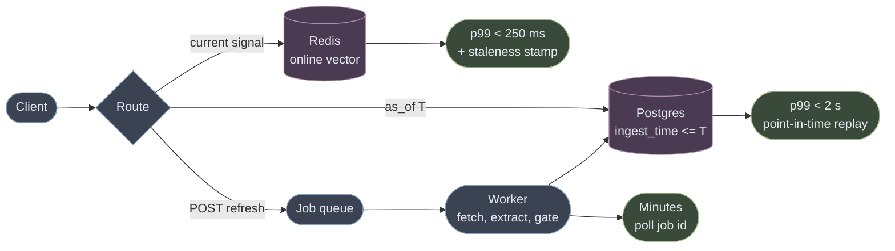

| Path | SLO |
|---|---|
| Any precomputed signal, any `as_of` | p99 < 250 ms — **a UI-responsiveness SLO, not a trading one** |
| Point-in-time replay, arbitrary `as_of` | p99 < 2 s |
| Fresh inference on a new document | minutes, async, job-polled |
| **Freshness honesty** | **100% of responses carry evidence timestamps. Zero silent staleness.** |

Sub-second on cached reads is free — it is a database index, not an achievement. **The SLO that
matters is that a consumer can always distinguish a quiet market from a stalled pipeline**, which
is why every payload carries its own staleness.

## 11. Model serving

| Workload | Choice |
|---|---|
| **Triage** (everything) | hosted 8B-class, no batch — it gates the pipeline |
| **Extraction** (~1–5%) | hosted frontier mid, **batched into 15–30 min windows** |
| **Embeddings** | hosted, batch the backfill |
| **Vision** | general VLM for language, **a geospatial foundation model for pixels** |

Self-hosting the cheap tier cannot win at any volume, extraction break-even is ~15x this volume,
and caching only pays if extraction is batched. Arithmetic in [COST.md](COST.md) §4.

---

## 12. Orchestration: workflows, with two exceptions


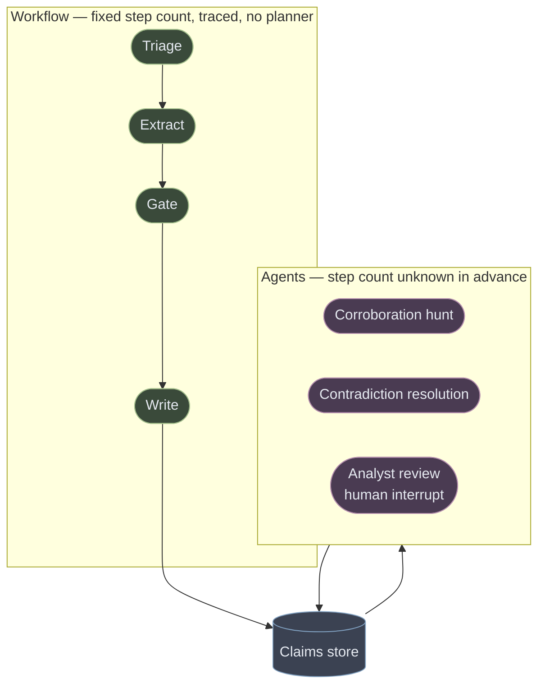

**Everything in the left box is a function call.** Modelling it as graph nodes buys one uniform
tracing surface, not a state machine — and the design says so rather than pretending the linear
path needed a planner. Only the right box uses checkpointing, resumability and interrupts.

**Most of this pipeline is not agentic and should not be.** Triage, extraction, grounding, scoring
and serving are a fixed sequence. Two jobs warrant agency because the step count is unknown:
**corroboration hunt** and **contradiction resolution** — each with a step budget, a wall-clock
cap, and partial results rather than a loop.

What the evidence says, since these patterns are usually chosen by fashion:

| Decision | Why |
|---|---|
| **No chain-of-thought on extraction** | Gains are almost exclusive to math and symbolic tasks; negligible or negative elsewhere, and it fights constrained decoding |
| **Schema-constrained decoding** | Better on **both** axes — improves quality up to 4% and speeds generation. The widely-cited "format hurts reasoning" result ran its structured arm as naive JSON-mode with no schema |
| **A deterministic verifier, not an LLM critic** | Intrinsic self-correction fails and sometimes degrades; it works only with reliable *external* feedback. The grounding gate is that feedback |
| **No debate** | 60.7% at 17,401 tokens vs **66.7% at 619** for isolated self-correction — worse accuracy at ~28x the spend, by sycophantic conformity |
| **No ensembling of similar models** | A 9-model panel from 7 families carries ~**two** independent votes; error correlation *increases* with accuracy |
| **No long chains** | 70% per step over three steps is **34%**. Multiplicative |
| **No tools on the extractor** | Untrusted content + tool access is the injection setup. Break the lethal trifecta |


### Inside an agent, and where it is forced to stop

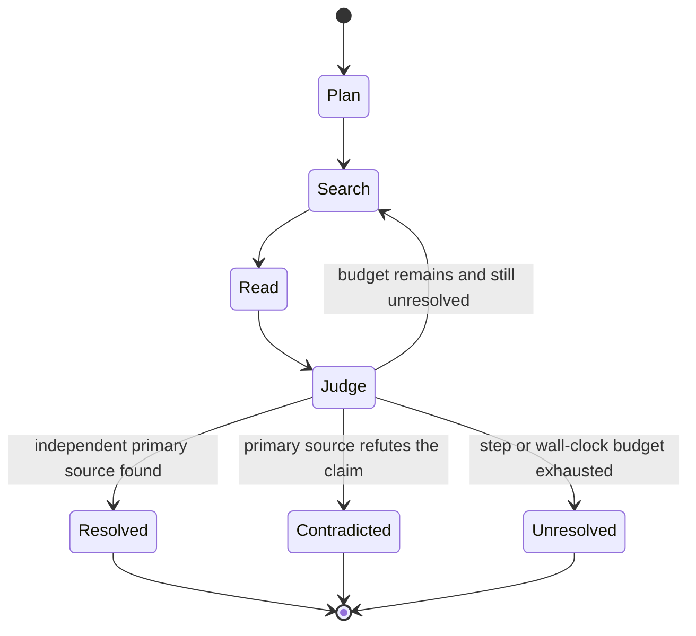

**Three terminal states, and `Unresolved` is first-class.** An agent that cannot finish returns
partial evidence and lowers confidence — it never loops, and never adjudicates by asking a second
model to agree. Tools are read/search only: no write, no send, breaking the lethal trifecta inside
the agent too.

**Fan out by lens, not by volume.** Three agents asking the same question produce correlated
agreement that reads as confirmation. Three with different remits produce information.

**No session or memory store.** This is a pipeline, not a chat agent: its state is the claims
table — durable, bitemporal, already the source of truth. A vector "memory" would be a second,
unversioned copy of facts that already have point-in-time semantics.

---

## 13. Evaluation, retraining, and the loop that must not become a spiral

### The golden dataset is three datasets

| | **Gold-A — extraction** | **Gold-B — triage** | **Gold-C — outcome** |
|---|---|---|---|
| Question | does the claim reflect the document? | is this tradeable at all? | did it happen and matter? |
| Market knowledge needed | **none** | a little | **yes** |
| Size | ~3,400 claims | ~40,000 docs | ~200 events |

**Gold-A matters most and costs least** — checking a span, a number and an entity needs no view on
prices, and the gate adjudicates much of it mechanically. **Gold-C is a falsification set, not a
training set**; 200 events is enough to reject, not to fit.

**Two ordering rules, both load-bearing:** dedup **before** splitting (syndication otherwise puts
the same story in train and test), and split by **time** with an embargo equal to the longest
label horizon.

### Self-improvement needs external ground truth


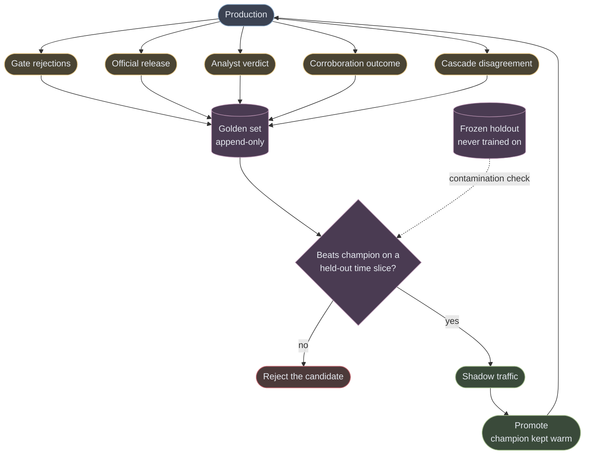

The model critiquing itself does not work. What works is that the architecture already emits five
free label sources: **gate rejections** (mechanical, immediate), the **official release** scoring
outstanding nowcasts, **analyst verdicts**, **corroboration outcome**, and **cascade
disagreement** — free active learning, since where cheap and frontier models disagree is exactly
what is worth labelling.

**What may learn, and what never may:**

| Learns | Never learns |
|---|---|
| triage classifier, prompt (CI-gated), alias table, calibration, retrieval weighting | **the grounding gate**, the scoring arithmetic, the two clocks |

**A referee that learns can learn to pass what it should fail** — and then every metric improves
while the system gets worse. Everything in the right column is what a self-improving loop would
eventually optimise away, because relaxing a constraint always improves the watched metric.

**The spiral:** a wrong extraction the reviewer misses enters the golden set and teaches the next
generation the same error — silently, since the metric is computed against the contaminated set.
Mitigations: **blind labelling** on a fixed fraction (the only one that breaks anchoring), a
**frozen holdout**, label provenance. **Detection is the live-golden vs frozen-holdout gap** — the
only measurement the loop cannot game.

### Monitoring is four planes

**Trace** (spans, tokens, latency, prompt version) comes from the vendor. **Data** (publisher,
language, length mix, arrival gaps), **quality** (gate rejections, calibration, nowcast error) and
**cost** ($/claim, cache-hit rate) you build.

**The lineage no vendor supplies is trace → claim → signal → outcome six weeks later.** Every claim
carries `trace_id` and the version quartet, or "the model got worse in March" is unanswerable.

**Continuous ablation.** Monthly, pull each component and measure both sides. The resulting
marginal-value-per-dollar table *is* the degradation order when the budget governor fires.

---

## 14. Deployment topology

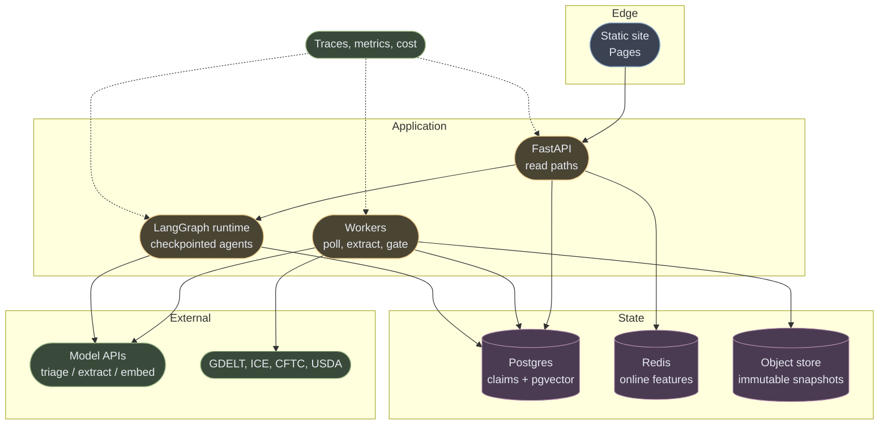

**Why this shape:**

- **No third party on the request path.** Workers poll feeds and models on their own schedule and
  write; the API only reads. A failing upstream degrades freshness — which the payload reports —
  rather than erroring at a trader.
- **One database plus a cache.** Claims, embeddings and features share a transaction boundary, so
  an embedding and the claim citing it commit together. Object storage holds snapshots: write-once
  and large.
- **Observability spans all three compute components**, and its trace id is written into the claim
  row — otherwise an outcome arriving six weeks later has nothing to attribute to.
- **Scaling order:** stateless workers first, then read replicas, then the vector index moves out.
  A real broker only when 3+ independent consumers need replay — never for throughput.

---

## 15. The kill battery: cheap tests that can end this before any modelling

| | Test | Kill if | Cost |
|---|---|---|---|
| **K1** | What fraction of the price move around an event happens before our `ingest_time`? | ≥60% is already gone | 3 days |
| **K4** | Documents/day after near-duplicate clustering | fewer than 5 genuinely independent | 2 days |
| **K7** | Net Sharpe after transaction costs, purged out-of-sample | < 0.30 | — |

**K4 currently fails: 4.2 effective documents/day against a threshold of 5.** On the measured
corpus that is a stop, and it needed no price data. Reported rather than quietly widened, because
a battery you only run until it passes is not a battery.

## 16. What this deliberately does not build

Streaming infrastructure (116 msg/sec is one box); a dedicated vector database; a feature-store
product; a fine-tuned extractor; multi-agent debate; conversational memory; self-hosted
inference; and any model whose information coefficient has not been measured.

Each has a stated trigger. **Adopting them earlier buys operational surface to solve problems this
system does not have.**
