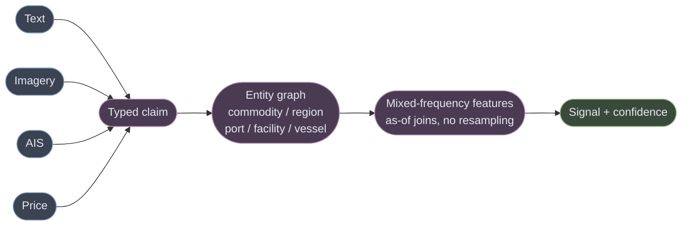

# Architecture

A system that ingests heterogeneous commodity data, extracts trading-relevant signals with LLMs
and multimodal models, and serves them at sub-second for cached queries and minutes for fresh
inference.

Every number here is measured or cited. Where a measurement contradicted an earlier assumption,
the current number is stated — see [EVIDENCE.md](EVIDENCE.md) for what was tested and what died.

---

## 1. The brief's volumes are a misdirection, and saying so is the answer

| Stated | Actually |
|---|---|
| 10M AIS pings/day | **116 messages/second** — one Postgres box |
| ~500 documents/day | ~1M tokens, **single digits of dollars** |
| TB-scale daily imagery | genuinely large — but the cost is the **licence**, not the GPU |

Only imagery is big, and its cost is a *licensing and tasking-policy* problem rather than a
compute one ([COST.md](COST.md) §2: tasking policy alone is 96% of the gap between a careless
and a staged build). **A candidate who sizes Flink for the AIS feed has misread the brief.**

The genuinely load-bearing feed is the cheapest: **merchant-vs-fund positioning** tells you who is
offside, which decides whether news causes a squeeze or a shrug.

## 2. Breadth has a ceiling, and it is lower than it looks

Under the fundamental law with correlation-adjusted breadth:

```
BR_eff = N / (1 + (N-1)ρ) × T
as N → ∞,  BR_eff → T/ρ = 52/0.2 = 260 bets/yr
max achievable IR = 0.0301 × √260 = 0.486
```

**You cannot buy IR 0.5 by adding commodities at weekly rebalance. Ever.** Going from 1 commodity
to 20 multiplies IR by ~2.0x, not 4.5x.

So the engineering mandate — **nothing hardcoded to one commodity** — is real but narrower than it
sounds. Tested against wheat: the claim schema, two clocks, grounding gate and dedup transfer;
the multi-venue resolver, class-spread engine and government-action ingestion do not. **N+1 is
cheap for scaffolding, not for the pipeline** (EVIDENCE §3).

---

## 3. The load-bearing decision: extraction is not prediction

**The LLM turns prose into typed, cited claims. Deterministic arithmetic turns claims into
signals. The model never emits a price, an invented direction, or a probability.**

The naive "news in, signal out" build is simultaneously unauditable (nobody can say why the
number moved), uncalibrated (an LLM's "0.7 bullish" is not a probability of anything), and it
pipes pretraining contamination straight into the predictor. Splitting fixes all three and makes
retraining cheap, because the expensive half stops changing.

## 4. Two clocks, from the first row

Every record carries `event_time` (when the world changed) and `ingest_time` (when we learned).
Every query names which it means; point-in-time reads filter on `ingest_time`.

**This cannot be retrofitted.** You can recover when something happened; you can never recover
when you learned it. One column now, or an honest backtest never.

---

## 5. Heterogeneous data: fuse at the claim, never at the tensor

The reflex is to embed text, imagery and series into a shared latent space. **Wrong level, for
four checkable reasons:** no shared time base (a satellite pass is 5–6 days, a tick is 100ms, and
the relative timing *is* the signal); forgeability differs by orders of magnitude; a joint
embedding is **unauditable**; and the modalities have three incompatible revision policies.

The level at which they are commensurable is the **claim**. Every modality is a sensor emitting a
typed measurement about a canonical entity, with a pointer to its own evidence:

| Modality | Evidence pointer |
|---|---|
| Text | **character span** in the immutable snapshot |
| Imagery | **AOI polygon + capture timestamp + pixel stats** |
| AIS | vessel id + position-track window |
| Price / stocks | series window + threshold used |
| Macro | release id + **vintage id** |



**The entity graph is what makes this one system** rather than three pipelines in a trenchcoat.
"Sul de Minas" in Portuguese prose, an AOI polygon, and a port call at Santos are the same subject
only because a canonical temporal entity resolves all three.

**Absence means something different in every modality, and conflating the two kinds is how
multimodal systems break silently.** Cloud is not "no damage"; a dark vessel is not "not sailing";
a failed fetch is not a flat line. Every claim carries an **observation status** —
`observed`, `observed_absent`, `not_observed`, `degraded` — and an unmeasured signal **widens its
interval rather than narrowing it**. SAR over optical in the coffee belt follows directly: radar
penetrates the cloud that blinds optical exactly during the wet season.

**Mixed frequency uses as-of joins, never resampling.** Weekly positioning stays weekly, daily
imagery stays daily; the model sees the lags explicitly rather than averaged away.

**Confidence is per-modality, and physical evidence dominates.** Three agreeing articles are one
cheap fact repeated. An article *plus* a draught change *plus* an AOI delta is a fact someone
would have to spend real money to fake — so **high-conviction signals require corroboration from a
physical modality.** That single rule is both the adversarial-news defence and the confidence
model, which is the argument for it.

---

## 6. Ingestion and the cascade

One bus, per-source connectors, immutable bronze, bitemporal from row one. **GDELT is snapshotted
at ingest because it revises its own archive** — a backtest against its current archive reads
documents that did not exist at their claimed timestamps.


The measured funnel: 96,405 documents/day → 88.3 with a coffee term in the title → **4.7
tradeable**. The cheap filter removes **95% of coffee-mentioning documents**; end to end the
funnel is ~99.5%. Precision, not recall, is the scarce resource.

**The extractor is structured-output-only with no tool access.** Documents are hostile input, and
a model that can call tools on attacker-controlled text is an attack surface with a market
position attached.

### The grounding gate

A numeric claim is rejected unless its figure appears **literally in the cited span**, NFKC-
normalised. This is the system's referee and it is deterministic.

Two rules that make it real rather than decorative:

- **Verify against the original document, never the chunk.** If the gate resolves against the
  chunk, a fabrication straddling a boundary verifies clean — the gate would confirm the model's
  own input. Chunks carry `char_offset` back into the snapshot.
- **A check that cannot fail is worse than no check**, because it reports as passing. This
  codebase shipped `nums_ok = _numbers(...) or True` — a number gate that never existed while
  being claimed in three places.

### Chunking

**Most documents are not chunked.** A trading claim is not local: a number in paragraph six is
meaningless without the subject in paragraph one, and wire stories fit one context. Chunking
applies only to analyst PDFs and transcripts, where the rules are: split on **structural
boundaries** never fixed token counts; **never separate a number from its unit or subject**; carry
a document-level header into every chunk; and store `char_offset`.

**No summarisation before indexing.** The gate verifies verbatim spans; a summary leaves nothing
to check. Every shipped precedent agrees — contextual retrieval *prepends* a blurb and never
replaces the chunk, cutting top-20 retrieval failure from 5.7% to 3.7%, and to 2.9% with
contextual BM25.

---

## 7. Retrieval: three of the four jobs are not search

The extractor gets **no retrieval** — the document is the input, and retrieved passages invite
citing text the source never contained. Retrieval serves memory, not context:

| Job | What it actually is |
|---|---|
| **Novelty** | **near-duplicate detection** — MinHash/SimHash + LSH. Cosine similarity conflates "same fact restated" with "related but distinct", the boundary that must stay sharp |
| **Entity resolution** | **record linkage** — alias table + fuzzy match resolves most mentions in microseconds; embeddings are fallback candidate generation, never auto-accept, and every resolution writes back |
| **History** | **a `WHERE` clause** on `(entity_id, time_range)` |
| **Corroboration** | the only genuine hybrid search |

**Hybrid search is insurance against disjoint failure modes**, not a silver bullet: BM25 cannot
connect "Sul de Minas" to "South of Minas"; dense collapses on rare tokens — contract codes, lot
numbers, exact figures. But fusion itself buys ~1–1.7%. Use RRF (k=60) until corroboration
accept/reject decisions supply a label set, then a tuned convex combination.

**A reranker would actively harm two jobs** — for novelty it ranks the duplicate highest, exactly
backwards; for corroboration it has no notion of publisher independence and ranks two syndicated
copies as mutually relevant. It earns its place only on disambiguating 5–20 entity-resolution
candidates.

**Corroboration is data engineering, not a better model.** Syndication is systematic and
text-similarity returns those copies *first*. The publisher/syndication graph is the whole
ballgame; measured dedup ratio 0.121 means **12% is echo**.

---

## 8. Storage and indexing

**One Postgres instance holds everything.** At the pilot's volume a dedicated vector database
solves a problem we do not have.

**Bitemporality with range types, not an extension** — no maintained bitemporal Postgres
extension exists, and this is the most correctness-critical table in the system:

```sql
EXCLUDE USING gist (
  claim_key       WITH =,
  effective_range WITH &&,   -- event_time axis
  asserted_range  WITH &&    -- ingest_time axis
)
```

Composite B-tree `(claim_key, ingest_time DESC)` serves both the `as_of` filter and
latest-version-per-claim. Append-only: never `UPDATE`, insert a new version. Build the
materialised "current" view and vacuum monitoring on day one.

**The pgvector cliff is a RAM cliff, and it arrives earlier than the vector-count ceiling
suggests.** Measured on a 32GB box at 1536 dims: QPS held at ~2,100 to 2M vectors, fell 45% at
2.5M when the index passed `shared_buffers`, and **collapsed 95% by 3M — to 102 QPS — while the
buffer hit ratio stayed above 98%**, so nothing looked wrong in the metric people watch.

Mitigations: `halfvec`, `shared_buffers` sized above the index, and truncation. At the chosen
1024-dim embedder — or truncated to 512, which retains 94–96% of NDCG@10 — the index is
proportionally smaller than the 1536-dim measurement above. **The ceiling is ~10M vectors
provisioned properly, ~3M if not.**

**Filtered vector search degrades far worse than expected, and our filters are the bad case.** A
single broad filter drops recall to **90.8%**; an AND over two broad values to **39.7%**.
Pre-filtering fragments the HNSW graph; post-filtering silently returns too few or zero. **pgvector
0.8+ iterative index scans are load-bearing.**

**Embeddings: multilingual is the binding constraint, and it excludes the finance-tuned models.**
Sources are Portuguese, Vietnamese and Spanish; the finance-specific embedders show real
finance-retrieval lift and **none has demonstrated coverage of those languages**. Take finance lift
from a downstream reranker instead.

**Metadata that earns its place:** `char_start`/`char_end` (required — this is what makes
"embed raw" usable by the gate), `publisher_independence_id` (the corroboration filter),
`event_time`/`ingest_time`, `entity_ids[]`, `language`, `observation_status`, and the lineage
quartet `trace_id` / `prompt_version` / `extractor_version` / `embedding_model_version`.

### Feature store, sized honestly

We have point-in-time correctness at **hundreds** of entities, not train/serve skew at millions.
So: **one Postgres table for offline, one Redis hash for online, and a single transform function
imported by both paths.** Skew is prevented by there being literally one function — stronger at
this scale than a registry two code paths consult.

Adopt a real feature store when several models share features, several teams author transforms,
or online reads pass a few thousand/second. **What must not be deferred at any scale:** every
feature vector records the `ingest_time` watermark it was built under.

---

## 9. Signal layer, and the test that falsified our own hypothesis

Three signals of deliberately different statistical character: `supply_risk` (0–100, continuous),
`price_pressure` (−100…+100, directional with an explicit horizon and contract), `policy_shock`
(0–100, discontinuous). Each decays on its own half-life — 5, 2 and 45 days.

**Regime conditioning is why positioning matters.** Identical news is bullish in a tight market and
noise in a glut.

**Tested over 519 weekly observations, the contrarian trade is dead:** r = −0.007, indistinguishable
from zero. The magnitude claim survives (crowding correlates with |return|, t = +2.79) but **the
mechanism is backwards** — the middle of the crowding distribution moves most, not the tails.
Reported here rather than quietly dropped, because that is the whole method.

## 10. Serving: promise freshness, not latency

| Path | SLO |
|---|---|
| Any precomputed signal, any `as_of` | p99 < 250 ms — **a UI-responsiveness SLO, not a trading one** |
| Point-in-time replay, arbitrary `as_of` | p99 < 2 s |
| Fresh inference on a new document | minutes, async, job-polled |
| **Freshness honesty** | **100% of responses carry evidence timestamps. Zero silent staleness.** |

Sub-second on cached reads is free — it is a database index, not an achievement. **The SLO that
matters is that a consumer can always distinguish a quiet market from a stalled pipeline**, which
is why every payload carries its own staleness.

## 11. Model serving

| Workload | Choice | Why |
|---|---|---|
| **Triage** (everything) | hosted 8B-class, no batch | it gates the pipeline, so latency matters. **Pricing it at a frontier small model costs ~53x more per document** |
| **Extraction** (~1–5%) | hosted frontier mid, **batched into 15–30 min windows** | correctness-critical. Batching is what makes prompt caching pay — outside the TTL every call is a fresh *write* at 1.25x that no read amortises |
| **Embeddings** | hosted, batch the backfill | $50–350 one-time |
| **Vision** | general VLM for the language layer, **a geospatial foundation model for pixels** | general VLMs are documented-weak at counting and localisation on satellite imagery |

**Self-hosting the cheap tier cannot win at any volume** — a GPU at *100% utilisation* is ~11x the
hosted rate. It is a pricing-floor problem, not a utilisation problem. What eventually forces a
dedicated deployment is **capacity**, not cost. If it happens, **SGLang** — RadixAttention is the
textbook fit for a fixed prefix with a varying suffix, and it hides constrained-decoding overhead.

## 12. Orchestration: workflows, with two exceptions

**Most of this pipeline is not agentic and should not be.** Triage, extraction, grounding, scoring
and serving are a fixed sequence with known inputs. Two jobs genuinely warrant agency because the
step count is unknown in advance: the **corroboration hunt** and **contradiction resolution** —
both with a hard step budget, a wall-clock cap, and partial results rather than a loop.

What the evidence says, since these patterns are usually chosen by fashion:

| Decision | Why |
|---|---|
| **No chain-of-thought on extraction** | Gains are almost exclusive to math and symbolic tasks; negligible or negative elsewhere, and it fights constrained decoding |
| **Schema-constrained decoding** | Better on **both** axes — improves quality up to 4% and speeds generation. The widely-cited "format hurts reasoning" result ran its structured arm as naive JSON-mode with no schema |
| **A deterministic verifier, not an LLM critic** | Intrinsic self-correction fails and sometimes degrades; it works only with reliable *external* feedback. The grounding gate is that feedback |
| **No debate** | 60.7% at 17,401 tokens vs **66.7% at 619** for isolated self-correction — worse accuracy at ~28x the spend, by sycophantic conformity |
| **No ensembling of similar models** | A 9-model panel from 7 families carries ~**two** independent votes; error correlation *increases* with accuracy |
| **No long chains** | 70% per step over three steps is **34%**. Multiplicative |
| **No tools on the extractor** | Untrusted content + tool access is the injection setup. Break the lethal trifecta |

**Fan out by lens, not by volume.** Three agents asking the same question produce correlated
agreement that reads as confirmation. Three with different remits produce information.

**No session or memory store.** This is a pipeline, not a chat agent: its state is the claims
table — durable, bitemporal, already the source of truth. A vector "memory" would be a second,
unversioned copy of facts that already have point-in-time semantics.

---

## 13. Evaluation, retraining, and the loop that must not become a spiral

### The golden dataset is three datasets

| | **Gold-A — extraction** | **Gold-B — triage** | **Gold-C — outcome** |
|---|---|---|---|
| Question | does the claim reflect the document? | is this tradeable at all? | did it happen and matter? |
| Market knowledge needed | **none** | a little | **yes** |
| Size | ~3,400 claims | ~40,000 docs | ~200 events |

**Gold-A matters most and costs least** — checking a span, a number and an entity needs no view on
prices, and the gate adjudicates much of it mechanically. **Gold-C is a falsification set, not a
training set**; 200 events is enough to reject, not to fit.

**Two ordering rules, both load-bearing:** dedup **before** splitting (syndication otherwise puts
the same story in train and test), and split by **time** with an embargo equal to the longest
label horizon.

### Self-improvement needs external ground truth

The model critiquing itself does not work. What does is that this architecture already generates
five free label sources: **grounding-gate rejections** (zero cost, mechanical, immediate), the
**official release** scoring outstanding nowcasts, **analyst confirm/reject** in the UI,
**corroboration outcome** (the exclusive-versus-fabrication discriminator), and **cascade
disagreement** — which is active learning for free, since the set where cheap and expensive models
disagree is exactly the set worth labelling.

**What may learn, and what never may:**

| Learns | Never learns |
|---|---|
| triage classifier, prompt (CI-gated), alias table, calibration, retrieval weighting | **the grounding gate**, the scoring arithmetic, the two clocks |

**A referee that learns can learn to pass what it should fail** — and then every metric improves
while the system gets worse. Everything in the right column is what a self-improving loop would
eventually optimise away, because relaxing a constraint always improves the watched metric.

**The spiral:** the system poisons its own training set. A wrong extraction the reviewer misses
enters the golden set and teaches the next generation the same error with more confidence — and
it is silent, because the metric is computed against the contaminated set. Mitigations: **blind
labelling** on a fixed fraction (the only one that breaks the anchoring), a **frozen holdout**
never used for training, and label provenance. **Detection is the gap between live-golden and
frozen-holdout performance** — the only measurement the loop cannot game.

### Monitoring is four planes

**Trace** (spans, tokens, latency, prompt version) — the vendor gives you this. **Data** (publisher,
language and length mix; arrival gaps), **quality** (gate rejection rate, calibration, nowcast
error), **cost** ($/claim, cache-hit rate) — you build these.

**The lineage no vendor supplies is trace → claim → signal → outcome six weeks later.** Every claim
row carries `trace_id` and the version quartet, or "the model got worse in March" is unanswerable.

**Continuous ablation.** Monthly, pull each component and measure both sides. The resulting
marginal-value-per-dollar table doubles as the **degradation order** when the budget governor
fires — which matters because volume spikes exactly when the system is most valuable.

---

## 14. The kill battery: cheap tests that can end this before any modelling

| | Test | Kill if | Cost |
|---|---|---|---|
| **K1** | What fraction of the price move around an event happens before our `ingest_time`? | ≥60% is already gone | 3 days |
| **K4** | Documents/day after near-duplicate clustering | fewer than 5 genuinely independent | 2 days |
| **K7** | Net Sharpe after transaction costs, purged out-of-sample | < 0.30 | — |

**K4 currently fails: 4.2 effective documents/day against a threshold of 5.** On the measured
corpus that is a stop, and it needed no price data. Reported rather than quietly widened, because
a battery you only run until it passes is not a battery.

## 15. What this deliberately does not build

Streaming infrastructure (116 msg/sec is one box); a dedicated vector database; a feature-store
product; a fine-tuned extractor; multi-agent debate; conversational memory; self-hosted
inference; and any model whose information coefficient has not been measured.

Each has a stated trigger. **Adopting them earlier buys operational surface to solve problems this
system does not have.**
