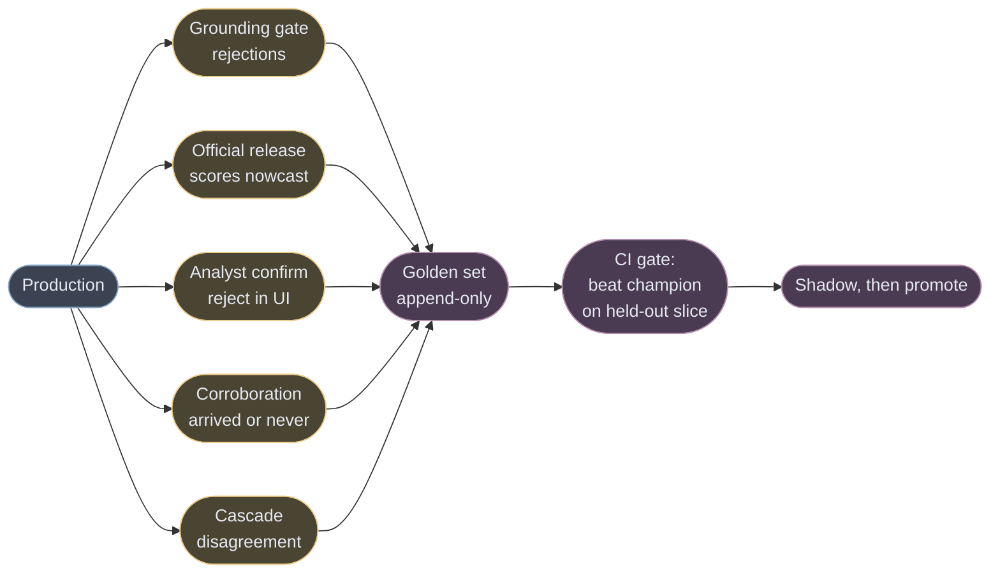

# Retraining and self-improvement

The brief asks for retraining loops. This covers those and the harder question behind them: how
a system like this gets better on its own without quietly getting worse.

---

## 1. The naive version, and why it fails

The pattern usually meant by "self-improving" is: the model reviews its own output, decides it
was wrong, and rewrites its prompt. **This is the specific thing the evidence says does not
work** — LLMs do not reliably self-correct without external feedback, and a critic drawn from the
same model shares its blind spots. Left alone it produces confident convergence, not improvement.

So the design question is not *how does the model critique itself*. It is:

> **What external ground truth does this architecture already generate, for free, as a byproduct
> of running?**

If the answer is "none," a self-improving system cannot be built and any claim to have one is
decoration. Here the answer is five sources, and not one of them asks a model to grade itself.

---

## 2. The five free label sources

| Source | What it labels | Cost | Latency |
|---|---|---|---|
| **Grounding gate rejections** | extractor errors — a span that isn't in the source, a number that isn't in the span | **zero**, it is mechanical | immediate |
| **Official release lands** | every nowcast outstanding at that moment, scored in the quantity's own units | zero | days to weeks |
| **Analyst confirm/reject** | claim correctness and usefulness, from people using the product anyway | zero marginal | immediate |
| **Corroboration outcome** | whether a single-sourced claim was ever independently confirmed — the exclusive/fabrication discriminator | zero | days |
| **Cascade disagreement** | the cheap filter says drop, the frontier extractor finds a claim (or vice versa) — precisely the ambiguous set | one extra cheap call | immediate |

**The gate is the most valuable of the five and the least obvious.** It runs on every extraction
anyway, it is deterministic, and it produces a labelled error the moment the model fabricates.
Most systems throw that away. Here it is the primary training signal for the extractor, and the
reason Gold-A can be mostly auto-labelled.

**Cascade disagreement is active learning for free.** The set where a cheap and an expensive model
disagree is, almost by construction, the set where a label is worth paying for. Sampling
uniformly for labelling instead wastes most of the budget on documents both models get right.

---

## 3. What is allowed to learn, and what must never

This is the safety boundary, and it is the difference between a loop and a spiral.

| Component | Learns? | Why |
|---|---|---|
| Triage classifier | **yes** | high volume, clear labels from gate + extractor outcomes, cheap to retrain |
| Extraction prompt | **yes, CI-gated** | changes must beat champion on a held-out slice |
| Entity alias table | **yes** | every unresolved mention is a named gap; this compounds and is the moat |
| Confidence calibration | **yes** | isotonic or Platt against realised outcomes |
| Retrieval weighting | **yes, slowly** | usage data on which retrieved claims were actually used |
| **Grounding gate** | **NEVER** | it is the referee. A referee that learns can learn to pass what it should fail, and every metric improves while the system gets worse |
| **Scoring arithmetic** | **NEVER** | deterministic by design — this is the extraction/prediction split. If the arithmetic learns, the LLM is predicting again through a side channel |
| **Two clocks / point-in-time** | **NEVER** | invariants, not parameters |

**Keep the invariants fixed and let only the estimators improve.** Every component in the "never"
column is one a self-improving system would eventually optimise away, because relaxing a
constraint always improves the metric being watched.

---

## 4. The loop

1. **Accumulate** labels from the five sources into the append-only golden set. Each carries the
   `ingest_time` it was created at and the model/prompt version it came from.
2. **Propose** a change — a new prompt, a retrained classifier, a new threshold. Prompts are
   semver'd and pinned in feature lineage exactly like model weights.
3. **Gate in CI.** The challenger must beat the champion on a **held-out time slice it has never
   seen**, with the embargo gap from PIPELINE.md §1. A prompt diff is a pull request that fails
   if the information coefficient regresses.
4. **Shadow.** Run challenger alongside champion on live traffic, serving champion. Compare on
   real data before anything is promoted.
5. **Promote** only on measured improvement, and keep the champion warm for instant rollback.

**Nothing self-promotes.** The loop generates candidates and evidence; the promotion decision is
gated by a metric on data the candidate could not have seen.

---

## 5. The failure that makes it a spiral

**The system poisons its own training set.** If the extractor is wrong and the reviewer does not
catch it, that wrong label enters the golden set and teaches the next generation to make the same
error — with more confidence, because now it is "validated." This is the same shape as model
collapse, and it is silent: every metric improves, because the metric is computed against the
contaminated set.

Three mitigations, all cheap:

- **Blind labelling on a fixed fraction.** For a sampled slice, the labeller never sees the
  model's output. Anchoring is the mechanism by which a wrong label gets confirmed, and not
  showing the output removes it. This costs a little labeller throughput and is the only one of
  the three that actually breaks the loop.
- **A frozen holdout that is never used for training.** Labelled once, early, and reserved
  permanently. If performance on the live golden set improves while the frozen holdout does not,
  the golden set is drifting toward the model.
- **Label provenance.** Every golden item records whether it was machine-proposed or
  human-originated. If the machine-proposed fraction climbs, the set is becoming a mirror.

**Detection:** track the delta between live-golden performance and frozen-holdout performance. A
widening gap is contamination, and it is the only reliable signal of it.

---

## 6. Retraining the things that are not the LLM

- **Triage classifier** — retrain on a rolling window whenever the gate/extractor outcomes shift.
  This is the piece that decays fastest, because publisher mix and phrasing drift constantly.
- **Calibration** — refit whenever enough outcomes land. Confidence that is not calibrated
  against realised outcomes is a number with a percent sign.
- **Regime state** — identical news is bullish in a tight market and noise in a glut, so the
  regime classifier is refit on market state rather than on text.
- **Embeddings** — changing the embedding model means a **full backfill**, and the old and new
  vector spaces are not comparable. Version the index and cut over atomically; never mix.

**Walk-forward only, purged K-fold with embargo, triple-barrier labels.** A random split leaks
the future through both syndication and overlapping label windows.

---

## 7. How you know the loop is working, and how you know it is lying

| Watch | Healthy | Alarm |
|---|---|---|
| Frozen-holdout vs live-golden gap | flat | widening → contamination |
| Gate rejection rate | slowly falling | falling fast → the gate may have been weakened, check its version |
| Machine-proposed share of golden set | stable | rising → set becoming a mirror |
| Nowcast error vs published consensus | falling | flat → the system reproduces a free number |
| Calibration curve | on the diagonal | drifting → confidence is decoration |
| Alias table growth | steady | stalled → entity resolution stopped learning, and it is the moat |

**The single most important one is the first.** Every other metric can improve while the system
degrades; the frozen holdout is the only measurement that cannot be gamed by the loop, because
nothing in the loop is allowed to touch it.
