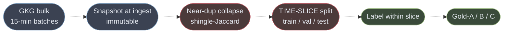
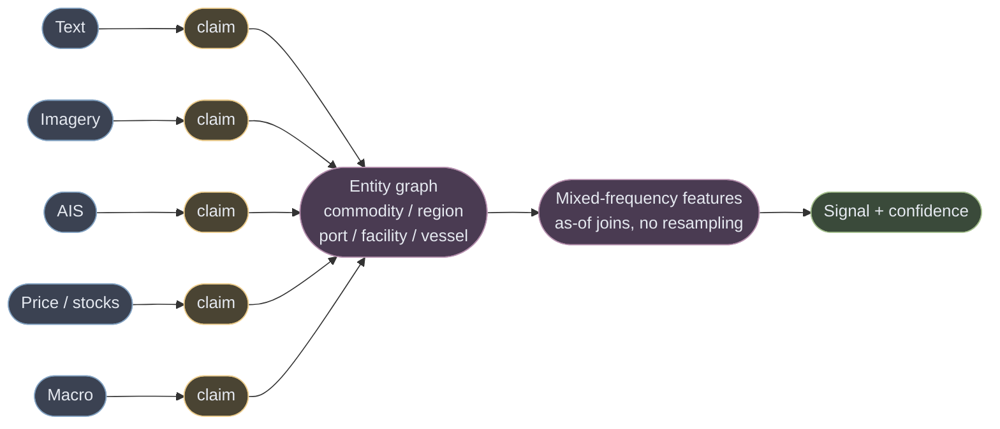
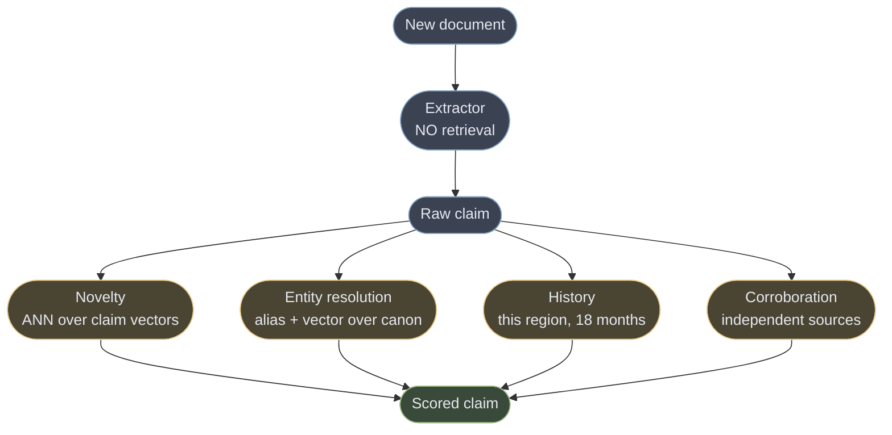
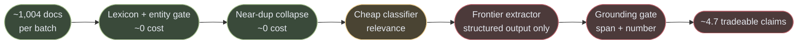
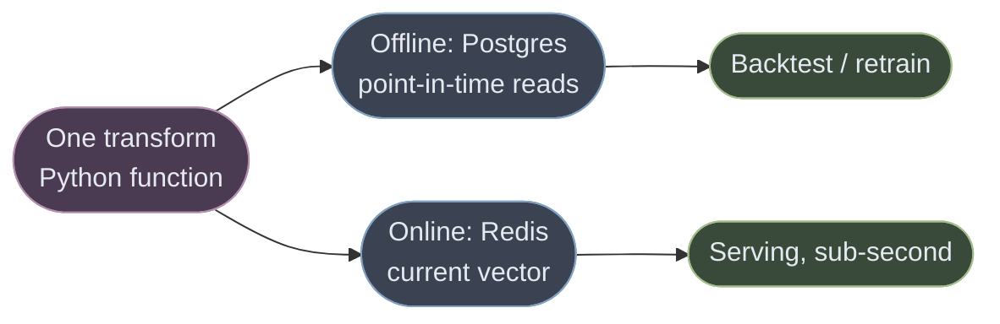

# The pipeline: golden set, chunking, retrieval, extraction, agents, feature store

The architecture document covers the seven layers. This one covers the parts a reviewer will ask
about specifically — how the golden dataset is built, how documents are chunked, where retrieval
is and is not used, where agency is warranted, and what the feature store actually needs to be at
this scale.

Assumption stated up front, per the brief: **we have a golden dataset built from GDELT.** §1
specifies what that dataset is, because "golden dataset" is three different datasets with three
different costs, and conflating them is the most common way an evaluation plan quietly becomes
unfalsifiable.

---

## 1. The golden dataset is three datasets, not one

The measured corpus is **4.7 tradeable coffee documents per day** after dedup and triage (the raw
GKG batch mean is 1,004 documents; the funnel is in COST.md). Over two years that is roughly
**3,400 documents** — small enough to label properly, which is the whole argument for triaging
hard before labelling.

They split by *what a label costs* and *what it gates*:

| | **Gold-A — extraction** | **Gold-B — triage** | **Gold-C — outcome** |
|---|---|---|---|
| Question | Does this claim faithfully reflect this document? | Is this document tradeable at all? | Did the claimed thing actually happen and matter? |
| Label | span correct, number correct, entity correct, direction correct | binary + reason code | realised outcome at horizon |
| Needs market knowledge | **no** | a little | **yes** |
| Cost per item | minutes | seconds | days-to-months of waiting |
| Size | ~3,400 claims | ~40,000 documents | ~200 events |
| Gates | the extractor, and the CI prompt-regression test | the cascade's cheap filter | the only thing that touches alpha |

**Gold-A is the one that matters most and costs least**, which is the useful asymmetry. Checking
that a quoted span exists, that a number matches, and that "Minas Gerais" resolved to `BR_MG`
requires no view on coffee prices whatsoever. It is verifiable by anyone, it is where the
model actually fails, and it can be **partly auto-labelled**: the grounding gate already
adjudicates span and number mechanically, so a human only reviews what the gate passes but a
second model disputes.

**Gold-C is the smallest and slowest, and that is correct.** It is the only tier that can prove
the system makes money, and it is the tier most likely to be overfitted. Two hundred events is
not enough to fit anything — it is enough to *reject*. Treat it as a falsification set, not a
training set, and pre-register what counts as a hit before looking.

### Construction, in the order that avoids the leak

Two ordering rules, and both are load-bearing:

**Dedup before splitting.** Syndication means the same wire story appears at forty domains. Split
first and the identical text lands in train and test, and every metric inflates. This is the
single most common silent defect in a news-model evaluation.

**Split by time, never at random.** A random split lets the model see February while being tested
on January. Test is strictly the most recent slice; validation is the slice before it; and there
is an **embargo gap** between them equal to the longest label horizon, so a Gold-C outcome whose
window straddles the boundary cannot inform the training side.

**GDELT revises its own archive**, so the snapshot at ingest is not optional. A golden set rebuilt
later from GDELT's *current* archive is a different dataset with the same name — and it will
quietly contain documents that did not exist at the timestamps it claims.

---

## 1b. Heterogeneous data: fuse at the claim, never at the tensor

The brief's sources are text, imagery, vessel tracks, price ticks, macro releases and audio. The
reflex is to embed everything into a shared latent space and let a multimodal model fuse it.
**That is the wrong level, for four reasons that are each checkable.**

1. **No shared time base.** Sentinel revisits every 5–6 days; a tick is every 100 ms; news is
   irregular and bursty; AIS is continuous. Forcing them onto a common grid means resampling, and
   the relative timing between modalities *is* the signal — that is what MIDAS exists for.
2. **Radically different forgeability.** An attacker can write an article for nothing. They cannot
   move 200,000 tonnes of coffee or repaint a warehouse roof. A joint embedding averages a cheap
   lie with an expensive fact and calls the result a feature.
3. **A joint embedding is unauditable.** When the number moves, nobody can say which modality
   moved it. For a trader-facing signal that is disqualifying, and it is also how the
   contamination in §1 becomes undetectable.
4. **They revise differently.** Imagery is final once captured; macro releases are revised for
   years; news gets corrected and retracted. One tensor cannot carry three revision policies.

### Every modality emits the same object

The level at which these data are genuinely commensurable is the **claim**. Each modality is a
*sensor*, and every sensor emits a typed measurement with a pointer to its own evidence:

| Modality | Extractor | Evidence pointer | Example claim |
|---|---|---|---|
| Text | LLM, structured output only | **character span** in the immutable snapshot | `frost, BR_MG, severity 0.7, event_time T` |
| Optical / SAR imagery | CV model over an AOI | **AOI polygon + capture timestamp + pixel stats** | `storage_area_change, facility F, -12%, T` |
| AIS | geofence + draught delta | **vessel id, position track window** | `port_call, Santos, laden departure, T` |
| Price / stocks series | deterministic detector | **series window + threshold used** | `stock_drain, ICE, 5-day run, T` |
| Macro release | schema parser + vintage | **release id + vintage id** | `fx_move, BRL, +2.1%, T` |
| Audio / transcript | ASR then LLM | **timecode span** | `guidance_change, company C, T` |

Nothing here says "bullish." Every row is a measurement about a **canonical entity** at an
`event_time`, carrying an `ingest_time` and an evidence pointer that a human can open. Fusion is
then a join on the entity graph — not a concatenation of vectors.

**The entity graph is what makes this one system.** "Sul de Minas" in Portuguese prose, an AOI
polygon over a drying yard, and a port call at Santos are the same subject only because a
canonical temporal entity resolves all three — with edges valid over `[start, end)`, because
facilities change owner and vessels change name. Without that layer, "multimodal" is three
pipelines in a trenchcoat sharing a dashboard.

### Absence means something different in every modality

This is the failure that silently breaks multimodal systems, and it has one rule:
**never conflate *observed-absent* with *not-observed*.**

| Modality | A gap means | Encoding it as zero produces |
|---|---|---|
| Optical imagery | **cloud** — and the tropical coffee belt is clouded exactly during the wet season, so it goes blind precisely when the weather damage it exists to detect is happening | "no damage observed" during a frost |
| AIS | **dark vessel** — transponder off, which is itself informative and is a known evasion behaviour | "the ship is not sailing" |
| News | nobody wrote about it, or the publisher changed its sitemap | "nothing happened" |
| Macro | release delayed or the schema changed upstream | a spurious zero print |
| Stocks series | exchange holiday, or a fetch that failed open | a fabricated flat line |

So every claim carries an **observation status** — `observed`, `observed_absent`, `not_observed`,
`degraded` — and the confidence model consumes it. A signal built only from `observed` rows while
half the AOIs were clouded is not a confident signal, it is an unmeasured one, and it must widen
its interval rather than narrow it. **SAR over optical in the coffee belt** follows directly:
radar penetrates cloud, so it is the modality that keeps reporting when the optical stream is
structurally blind.

### Mixed frequency is handled by as-of joins, never by resampling

Features are assembled by asking, for each entity at each decision time, *what was known then* —
an as-of join on `ingest_time`, per modality, at that modality's own cadence. Weekly positioning
stays weekly, daily imagery stays daily, irregular news stays irregular, and the model sees the
lags explicitly (MIDAS-style weighting) rather than having them averaged away. Aggregating
everything to a common frequency destroys exactly the timing relationships that carry the
information.

### Confidence is per-modality, and physical evidence dominates

Because forgeability differs by orders of magnitude, corroboration is **not** a count of agreeing
sources. A claim corroborated by three articles is one cheap fact repeated — and syndication makes
that the default outcome. A claim corroborated by an article *and* a draught change *and* an AOI
delta is a fact somebody would have had to spend real money to fake.

**High-conviction signals therefore require corroboration from at least one physical modality.**
That single rule is simultaneously the adversarial-news defence and the confidence model, which
is the argument for it: they are the same mechanism, so it costs one implementation.

---

## 2. Chunking

Most documents here **should not be chunked at all**, and saying so is the design decision.

A trading claim is usually not local. A number in paragraph six ("down 12%") is meaningless
without the subject established in paragraph one ("Minas Gerais arabica"). Chunk it apart and the
extractor either drops the claim or, worse, attaches the number to whatever entity is nearest in
the fragment. GDELT snippets and wire stories are 300–2,000 tokens — comfortably one context.

Chunking applies only to the long tail: analyst PDFs, earnings and call transcripts, government
bulletins. There the rules are:

| Rule | Why |
|---|---|
| Split on **structural boundaries** — headings, sections, speaker turns — never a fixed token count | A fixed window cuts mid-table and mid-sentence; the structure is already the author's own segmentation |
| **Never separate a number from its unit or its subject.** If a split would, move the boundary | This is the specific failure that manufactures wrong magnitudes |
| Carry a **document-level header** into every chunk (title, date, publisher, commodity) | Restores the context the split destroyed, at a cost of ~30 tokens |
| Store **`char_offset` into the original** on every chunk | See below — this is what keeps the grounding gate honest |
| Overlap by one structural unit, not by N tokens | Overlap exists to avoid orphaning a boundary claim, not to pad |

### The chunk-boundary hallucination, and why offsets are mandatory

**The grounding gate must verify a quoted span against the original document, never against the
chunk it came from.** If the gate resolves against the chunk, a fabricated claim whose quote
straddles a boundary can verify clean: the text exists in the fragment the model was handed, so
the check passes, while the claim it supports was never in the source as written. The gate would
be confirming the model's own input rather than the world.

So every chunk carries `char_offset` back into the immutable snapshot, and the gate always
resolves there. It is four bytes per chunk and it is the difference between a real check and a
tautology — this project already shipped one tautological gate (`nums_ok = ... or True`), and
the lesson is that a check which cannot fail is worse than no check, because it is reported as
passing.

---

## 3. Retrieval: for memory, not for context

**The extractor gets no retrieval.** The document is the input; adding retrieved passages to its
prompt invites it to cite text the source never contained, which is precisely what the grounding
gate exists to catch. Naive designs use RAG to feed the extractor. Here that is a defect.

Retrieval serves four jobs the document genuinely cannot answer about itself:

| Job | Query | Index | Why not a join |
|---|---|---|---|
| **Novelty** | the new claim | claim embeddings, last 90 days | "Frost in Minas" and "freezing temperatures across MG" are the same claim in different words. Exact match sees two |
| **Entity resolution** | the surface mention | canonical entities + aliases, temporal validity | "Sul de Minas", "South Minas", "MG south" all resolve to one region. This is the moat (see EDGE.md §6) and it is mostly alias tables with vectors as fallback |
| **History** | region + driver | claims, by entity | The confidence model needs "this region produced four frost claims in 18 months, three of which never appeared in official data" |
| **Corroboration** | the claim | claims across publishers | Independent sourcing, which requires publisher-independence, not text similarity — syndication looks like corroboration and is not |

**Sizing is the point.** At 4.7 tradeable documents a day, the claim index is thousands of
vectors, not millions. `pgvector` with an HNSW index in the same Postgres as the claims, so an
embedding and the claim citing it commit in one transaction. A dedicated vector database here
buys a second consistency boundary and an extra service to operate.

**Corroboration is the trap.** Two documents saying the same thing are evidence only if the
publishers are independent. Retrieval by text similarity returns syndicated copies first —
they are the most similar text in the corpus. So corroboration filters on publisher lineage
before counting, and the count is of *independent* sources, never of documents.

---

## 4. Extraction: a cascade, because precision is the scarce resource

Detail is in ARCHITECTURE.md §5. The shape, and the numbers that justify it:

Roughly **95% is eliminated before the expensive model**, which is why the LLM line is 0.4% of
the bill. The extractor is **structured-output-only with no tool access** — documents are hostile
input, and a model that can call tools on attacker-controlled text is an attack surface with a
market position attached.

---

## 5. Where agency is warranted, and where it is theatre

ORCHESTRATION.md carries the argument. The summary that belongs here:

**Most of this pipeline is not agentic and should not be.** Triage, extraction, grounding,
scoring and serving are a fixed sequence with known inputs. Wrapping a deterministic pipeline in
a planner adds latency, cost and nondeterminism to buy nothing — what is marketed as an agentic
commodity platform is usually a prompt in a loop over an index.

Two jobs genuinely warrant it, and both share a shape: **the number of steps is not known in
advance.**

| Job | Why agency | Bound |
|---|---|---|
| **Corroboration hunt** | "Find an independent source for this claim" is open-ended — how many searches, which sources, in which languages, is discovered while doing it | Hard step budget and a wall-clock cap; returns partial results rather than looping |
| **Contradiction investigation** | When two sources disagree on a number, resolving it means fetching the primary document, and which document that is depends on what the disagreement turns out to be | Terminates on a primary source or reports unresolved — never adjudicates by vote |

**Fan out by lens, not by volume.** Three agents asking the same question of the same corpus
produce correlated agreement that reads as confirmation and is not. Three agents with genuinely
different remits — one seeking the primary document, one seeking a contradicting source, one
checking the publisher's history — produce information. This session ran that experiment at
scale: agreement between similarly-prompted agents predicted nothing, and the disagreements were
where every real finding came from.

**Divergence resolves deterministically or not at all.** When agents disagree, a majority vote is
a confidence-weighted average of guesses. The tiebreaker is a rule — prefer the primary source,
prefer the earlier `ingest_time`, prefer the publisher with the better historical record — or the
claim is marked unresolved and its confidence drops. Nothing in this system is decided by asking
models to agree.

---

## 6. The feature store, sized honestly

The brief asks for a feature store, so here is the real answer rather than the fashionable one.

A feature store solves two problems: **train/serve skew** (the training transform and the serving
transform drift apart) and **point-in-time correctness at scale** (assembling features as they
stood at a historical instant, across millions of entities).

**We have the second problem and not the first, and we have it at hundreds of entities, not
millions.**

| | What we need | What Feast/Tecton assume |
|---|---|---|
| Entities | ~hundreds (commodity x region x driver) | millions |
| Online reads | a few per second | tens of thousands |
| Point-in-time | **mandatory** — it is the product | mandatory |
| Transform authoring | one Python function | a DSL and a registry |

So: **one Postgres table with a covering index for offline, one Redis hash for online, and a
single transform function imported by both paths.** Train/serve skew is prevented by there being
literally one function, which at this scale is stronger than a registry that two code paths
consult. Point-in-time is the `ingest_time <= as_of` filter already in the store.

**When to actually adopt one:** more than a handful of models consuming shared features, more
than one team authoring transforms, or online reads past a few thousand per second. Adopting it
before then buys a registry, a materialisation scheduler and a new failure mode, to solve skew
between two call sites of the same function.

**What must not be deferred, at any scale:** every feature vector records the `ingest_time`
watermark it was built under, and every model version pins the prompt version and extractor
version that produced its inputs. That is the part people postpone and cannot reconstruct later —
the same reason `ingest_time` itself is captured from row one.
